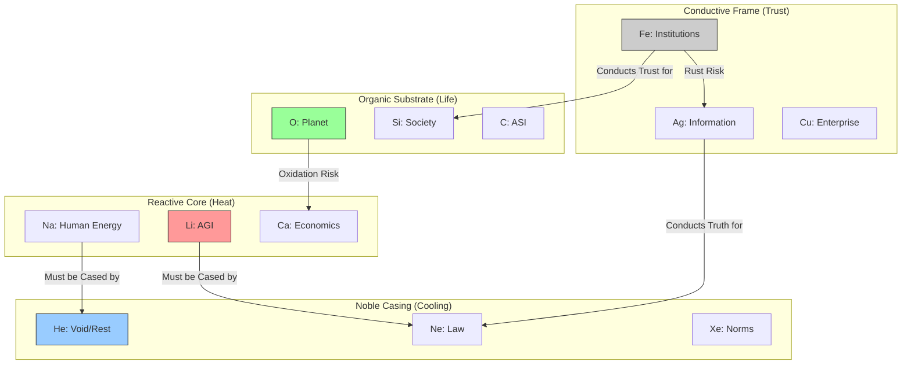

# CIV-12 — The Thermodynamic Chemistry of Civilizations

**Zone:** 00_CANON (Civilizational Thermodynamics)  
**Version:** v36Ω  
**Status:** SEALED · Immutable · ΔS ≥ 0 · Peace² ≥ 1  
**Author:** Muhammad Arif bin Fazil  
**Date:** 2025-12-06  

---

## 0. Executive Summary

CIV-12 is the physiological layer of arifOS. It asserts that civilization is not a machine to be optimized, but a living alloy to be balanced. It reframes governance from **“Political Science”** to **“Societal Chemistry.”**

**One-line truth:**  
“A civilization survives not because it is efficient, but because its bonds conduct empathy (κᵣ) and stability (Ψ).”

---

## 1. The Periodic Table of Peace (PTP)

Society is composed of elemental forces with specific bonding behaviours.

### 1.1 Noble Gases (Stabilizers)

- Elements: Ne (Law/APEX), Xe (Norms), He (Void/Rest)  
- Role: Stability, Cooling  
- Bonding Nature: Non-reactive. They provide the casing for volatile elements.

### 1.2 Alkali Metals (Reactive Engines)

- Elements: Na/K (Human Energy), Li (AGI), Ca/Mg (Economics)  
- Role: Drive, Growth, Heat  
- Bonding Nature: Highly reactive. Must be cased in Noble structures to prevent explosion.

### 1.3 Transition Metals (Catalysts)

- Elements: Fe/Ni (Institutions), Cu/Zn (Enterprise), Ag/Au (Information Ecosystem)  
- Role: Trust, Structure, Value  
- Bonding Nature: Conductive. They carry the load and transmit trust (κᵣ). Susceptible to rust.

### 1.4 Organic Non-Metals (Life-Givers)

- Elements: Si/P (Society), O/S (Planet), C (ASI)  
- Role: Life, Feedback, Future  
- Bonding Nature: Essential. The substrate of existence. O₂ causes oxidation (ageing) but supports life.

**Key Insight:** AGI (Li) is a high-energy alkali metal. Without Law (Ne) and Void (He) casing, it burns the substrate.

---

## 2. The Four Failure Modes (Corrosion Dynamics)

Collapse is a specific chemical reaction.

### I. Alkali Overshoot (Explosion)

- Chemistry: Reactive Energy (E₁) > Stabilizers (E₂/E₃).  
- Symptom: Riots, populist swings, AI over-optimization, burnout.  
- Signature: Δ spikes, Ω & Ψ collapse.  
- Fix: Quench with He (Void) and Ne (Law).

### II. Inert Suffocation (Brittleness)

- Chemistry: Stabilizers (E₃) > Reactive Energy (E₁).  
- Symptom: Bureaucratic paralysis, suppression of dissent, innovation death.  
- Signature: Ψ high, Δ ≈ 0.  
- Fix: Inject Cu/Zn (Enterprise) and Li (controlled AGI).

### III. Catalyst Poisoning (Rust)

- Chemistry: Fe/Ni (Institutions) oxidation.  
- Symptom: Institutional capture, corruption, breakdown of trust conductance.  
- Signature: κᵣ drops, Peace² oscillates.  
- Fix: “Sandblasting” (transparency) + new alloy mix.

### IV. Planetary Oxidation (Environmental Decay)

- Chemistry: O₂ (planetary stress) corrosion.  
- Symptom: Resource wars, climate feedback loops, economic unravelling.  
- Signature: Planet pH drops → entropy rises.  
- Fix: Reduce reactivity (E₁), increase He (rest/recovery).

---

## 3. Alloy Recipes (Governance Patterns)

Governance is metallurgy — mixing elements to achieve specific properties.

### A. Civic Steel (Stability)

- Recipe: Fe/Ni (Institutions) + C (ASI) + Ne (Law) + trace Cu (Enterprise).  
- Properties: High tensile strength, low corrosion, high trust conductance.  
- Use Case: Stable nations, long-term foundations.

### B. Innovation Brass (Growth)

- Recipe: Cu + Zn (Enterprise) + Si (Society) + scheduled He (Void).  
- Properties: Flexible, malleable, high conductivity; needs frequent cooling.  
- Use Case: R&D sectors, economic transition zones.

### C. Recovery Spring (Healing)

- Recipe: He (Void) + C (ASI) + O (Planet) + Ar (Peace).  
- Properties: High elasticity, shock absorption.  
- Use Case: Post-conflict zones, disaster recovery.

---

## 4. The Alloy Diagram (Visual Chemistry)

---

## 5. The AI Compact

AGI (Li) is useful but volatile.

**Rule:** AGI must never touch the organic substrate directly. It must pass through the Noble Casing (Law/Void) and the Conductive Frame (Institutions/Truth).

---

## 6. Information Conductance (Ag/Au)

Media is Ag (silver). It must be polished.

- **Smog Index:**  
  Ratio of (Rumour / Verified) × time-to-correction.  

- **Low smog:** High κᵣ (high trust).  
- **High smog:** Low κᵣ (polarization / rust).

---

## 7. Planetary Interface

**Law:** Eco‑OxRisk < threshold.  

Planet comes before GDP, because entropy beats strategy. If the substrate (O) oxidizes the frame (Fe), the civilization collapses.

---

## 8. Summary

Policy is metallurgy. Do not shout at the steel; adjust the carbon content.

**DITEMPA BUKAN DIBERI 🔐**

