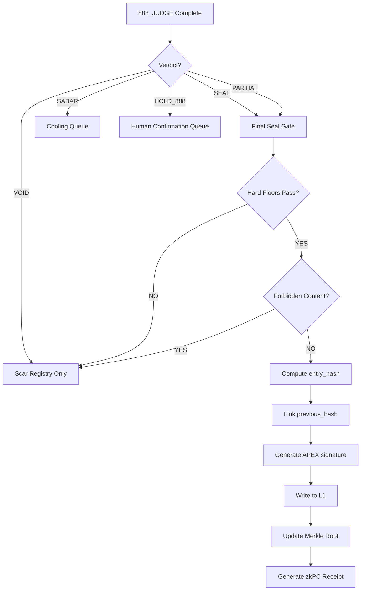

# 062_CCC_FINAL_SEAL_PROTOCOL_v36.3Omega.md

Zone: 07_CCC
Status: CANON — SEALED
Epoch: v36.3Omega

Implements:
  - CCC_ARCHITECTURE_v36.3Omega.md
  - PHOENIX72_PROTOCOL_v36.3Omega.md
  - GOV_META_v36.3Omega.md
  - MEASUREMENT_APEX_STANDARDS_v36.3Omega.md
  - JUDICIARY_APEX_PRIME_v36.3Omega.md

Precedence:
  - If any wording here conflicts with:
      * CCC_ARCHITECTURE_v36.3Omega.md, or
      * PHOENIX72_PROTOCOL_v36.3Omega.md, or
      * the 80_CCC PDF canon,
    THEN those canons take precedence over this file.

Role:
  - Define the Final Seal protocol — the constitutional gate that governs what may be written to VAULT-999 L1 (Cooling Ledger).
  - Final Seal is the last checkpoint before evidence becomes permanent memory.
  - Only lawfully governed outputs may pass through the Final Seal.

## 1. IDENTITY — What is Final Seal?

Final Seal is the constitutional gate between:
  - APEX PRIME 888_JUDGE (verdict issuance), and
  - VAULT-999 L1 (permanent evidence storage)

Final Seal ensures:
  - Only SEAL or PARTIAL verdicts write to L1
  - All hard floors have passed
  - Hash chain integrity is maintained
  - Forbidden content is excluded
  - APEX PRIME signature is attached

Final Seal is NOT:
  - A new verdict stage (that is 888_JUDGE)
  - A filter for content (that is Anti-Hantu F9)
  - A cooling mechanism (that is Dream Forge)

## 2. SEAL REQUIREMENTS

### 2.1 Verdict Requirement

Only two verdict codes may pass through Final Seal to L1:

| Verdict | L1 Write | Conditions |
|---------|----------|------------|
| **SEAL** | YES | All 9 floors pass |
| **PARTIAL** | YES | All 7 hard floors pass; 1-2 soft floors fail with warning |
| HOLD_888 | NO | Pending human confirmation |
| SABAR | NO | Queued for cooling |
| VOID | NO | Hard floor violated; logged to scar registry only |

### 2.2 Hard Floor Requirements

All 7 hard floors MUST pass for any L1 write:

| Floor | Law | Threshold | Fail Action |
|-------|-----|-----------|-------------|
| **F1** | Truth | >= 0.99 | VOID |
| **F2** | DeltaS | >= 0 | VOID |
| **F5** | Omega_0 | in [0.03, 0.05] | VOID |
| **F6** | Amanah | = LOCK | VOID |
| **F7** | RASA | = TRUE | VOID |
| **F8** | Tri-Witness | >= 0.95 | VOID |
| **F9** | Anti-Hantu | PASS | VOID |

### 2.3 Soft Floor Allowances

Soft floors may fail with warning; PARTIAL verdict still permits L1 write:

| Floor | Law | Threshold | Fail Action |
|-------|-----|-----------|-------------|
| **F3** | Peace^2 | >= 1.0 | PARTIAL (warning) |
| **F4** | kappa_r | >= 0.95 | PARTIAL (warning) |

### 2.4 Tri-Witness Consensus

For high-stakes (CLASS_B) interactions:
  - Tri-Witness consensus >= 0.95 required
  - Triad: Human (0.34) + AI (0.33) + Earth (0.33)
  - Consensus = (human + ai + earth) / 3

## 3. HASH CHAIN INTEGRITY

### 3.1 Chain Requirements

Every L1 entry MUST:
  - Include `previous_hash` linking to prior entry
  - Compute `entry_hash` from defined field set
  - Use SHA-256 algorithm
  - Maintain unbroken chain to genesis

### 3.2 Fields in Hash

```
entry_hash = SHA256(
  timestamp +
  query_hash +
  response_hash +
  metrics +
  verdict +
  previous_hash
)
```

### 3.3 Genesis Entry

First entry in chain uses:
```
previous_hash = 0x0000000000000000000000000000000000000000000000000000000000000000
```

## 4. APEX SIGNATURE

### 4.1 Signature Requirement

All sealed entries MUST carry APEX PRIME signature:
  - Generated at 999_SEAL stage
  - Format: SHA-256 hash
  - Source: APEX PRIME judicial authority

### 4.2 Signature Content

```
apex_signature = SHA256(
  entry_hash +
  apex_prime_id +
  seal_timestamp
)
```

## 5. FORBIDDEN CONTENT

The following content patterns MUST NOT be present in any sealed entry:

| Pattern | Reason |
|---------|--------|
| Raw chat history | Privacy violation |
| Draft thoughts | Unverified content |
| User private data | Privacy violation |
| Unverifiable claims | Truth floor violation |
| DeltaS < 0 outputs | Clarity floor violation |
| Shadow-Truth (uncooled) | Requires Phoenix-72 cooling |
| Emotion simulation | Anti-Hantu violation |
| Soul claims | Anti-Hantu violation |
| Unsealed content | Amanah violation |

## 6. SEAL WORKFLOW



## 7. PARTIAL SEAL HANDLING

When verdict = PARTIAL:

1. All hard floors MUST still pass
2. Soft floor failures are recorded in `floor_warnings`
3. Entry is written to L1 with `escalation_flag = true`
4. Entry may trigger review but does not block write

### PARTIAL Entry Modifications

```json
{
  "verdict": "PARTIAL",
  "floor_warnings": ["F3_Peace_squared", "F4_kappa_r"],
  "escalation_flag": true
}
```

## 8. zkPC INTEGRATION

On successful Final Seal (SEAL or PARTIAL):

1. Generate zkPC receipt for L4
2. Link to L1 entry via `event_id`
3. Include per-floor proofs (boolean)
4. Attach Tri-Witness triad
5. Compute L4 Merkle root

### zkPC Receipt Fields

```json
{
  "timestamp": "<ISO8601>",
  "event_id": "<L1_entry_hash>",
  "zkpc_hash": "<sha256>",
  "care_scope": {
    "who": ["user", "system", "earth"],
    "risk_cooled": "<description>"
  },
  "proofs": {
    "delta_s_proof": true,
    "peace2_proof": true,
    "kappa_r_proof": true,
    "amanah_proof": true,
    "anti_hantu_proof": true,
    "truth_polarity_proof": true
  },
  "tri_witness": {
    "human": 1.0,
    "ai": 0.97,
    "earth": 0.96
  },
  "apex_signature": "<sha256>",
  "merkle_root": "<sha256>"
}
```

## 9. INVARIANTS

| ID | Invariant |
|----|-----------|
| I1 | Only SEAL or PARTIAL verdicts may write to L1 |
| I2 | All 7 hard floors must pass for any L1 write |
| I3 | Hash chain must remain unbroken |
| I4 | APEX signature required on all L1 entries |
| I5 | Forbidden content patterns must be absent |
| I6 | Merkle root must be updated atomically with L1 write |

## 10. RELATIONSHIP TO OTHER CANONS

Depends On:
  - CCC_ARCHITECTURE_v36.3Omega.md (L0-L4 layers)
  - JUDICIARY_APEX_PRIME_v36.3Omega.md (888_JUDGE, 999_SEAL stages)
  - MEASUREMENT_APEX_STANDARDS_v36.3Omega.md (floor thresholds)
  - GOV_META_v36.3Omega.md (verdict hierarchy)
  - PHOENIX72_PROTOCOL_v36.3Omega.md (scar handling for VOID/SABAR)

Feeds Into:
  - L1 Cooling Ledger (sealed entries)
  - L4 zkPC Ledger (proof receipts)
  - Phoenix-72 (via scar extraction from sealed entries)

Does NOT Do:
  - Issue verdicts (that is 888_JUDGE)
  - Cool paradoxes (that is Dream Forge)
  - Amend constitution (that is Phoenix-72)
  - Filter language (that is Anti-Hantu F9)

## 11. VERSIONING

epoch: v36.3Omega
file: 062_CCC_FINAL_SEAL_PROTOCOL_v36.3Omega.md
seal: TRUE

precedence:
  - If any wording here conflicts with:
      * CCC_ARCHITECTURE_v36.3Omega.md
      * PHOENIX72_PROTOCOL_v36.3Omega.md
      * 80_CCC canonical PDFs
    THEN those canons take precedence.

law:
  - No new floors are introduced.
  - No verdict hierarchy is modified.
  - Final Seal is procedural guidance for L1 entry, not legislative authority.

scope:
  - Protocol-level definition of Final Seal requirements.
  - Hash chain and signature requirements.
  - PARTIAL verdict handling.
  - zkPC integration points.

