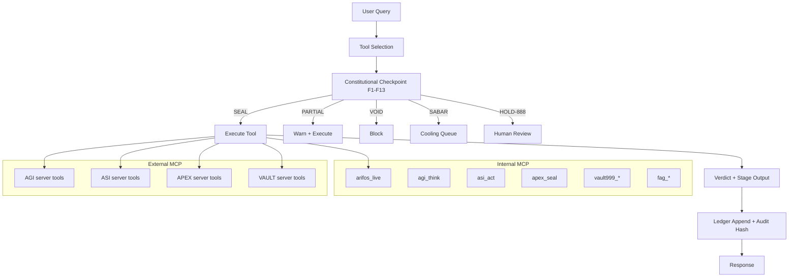

# arifOS v49 MCP Workflow Architecture

Status: draft (architecture/spec synthesis)
Version: v49 (sources cited below)

## Canonical sources used
- `000_THEORY/000_LAW.md` (F1-F13, verdicts, Phoenix-72)
- `000_THEORY/000_ARCHITECTURE.md` (aCLIP stages, engine roles, floor coverage)
- `arifos/mcp/unified_server.py` (internal MCP tool registry + search semantics)
- `arifos/mcp/unified_entry.py` (constitutional checkpoint, ledger logging)
- `arifos/config/mcp_tools_config.md` (external MCP tool inventory, costs)
- `arifos/servers/agi_server.py`, `arifos/servers/asi_server.py`,
  `arifos/servers/apex_server.py`, `arifos/servers/vault_server.py` (external server blueprints)
- `arifos/orchestrator/mcp_gateway.py` (gateway routing, stage inference)
- `AAA_MCP/v46/constitutional_floors.json` (F1-F12 thresholds; F13 in canon)
- `AAA_MCP/v46/cooling_ledger_phoenix.json` (Phoenix-72 + ledger spec)

Note: `AAA_MCP/v46/constitutional_floors.json` lists F1-F12 only, while
`000_THEORY/000_LAW.md` defines F1-F13. This document treats F13 as canonical
and documents it alongside F1-F12.

---

## 1. Architecture Overview

### Two-layer MCP system
1) Internal MCP tools (unified stdio server)
   - Implemented in `arifos/mcp/unified_server.py`.
   - Tool surface = 17 unique capabilities (18 names including 1 alias).
2) External MCP tools (AGI/ASI/APEX/VAULT servers)
   - Declared in `arifos/config/mcp_tools_config.md`.
   - 33 tools hosted across 4 external servers.

### Triple Engine Geometry
- AGI (Delta): orthogonal crystal (F2, F4, F7, F10, F13)
- ASI (Omega): fractal spiral (F1, F5, F6, F9, F11, F12)
- APEX (Psi): toroidal manifold (F3, F8; final judgment)

---

## 2. Tool Inventory

### Internal MCP tools (unified_server)
Unique capabilities (17). Names and aliases:
- `arifos_live` (aka `arifos_judge`, `apexprime_judge`) - full 000->999
- `agi_think`
- `agi_reflect` (aka `arifos_validate_full`)
- `asi_act`
- `apex_seal` (aka `apex_audit`)
- `agi_search`
- `asi_search`
- `vault999_query`
- `vault999_store`
- `vault999_seal`
- `fag_read` (aka `arifos_fag_read`)
- `fag_write` (aka `arifos_fag_write`)
- `fag_list` (aka `arifos_fag_list`)
- `fag_stats` (aka `arifos_fag_stats`)
- `arifos_meta_select`
- `arifos_executor`
- `github_govern` (aka `github_aaa_govern`)

### External MCP tools (33)
From `arifos/config/mcp_tools_config.md`:
- AGI server (13): brave_search, time, sequential_thinking, python, arxiv,
  wikipedia, http_client, memory, paradox_engine, perplexity_ask, executor,
  reddit, youtube_transcript
- ASI server (5): filesystem, slack, github, postgres, executor
- APEX server (4): claude_api, cryptography, vector_db, zkpc_merkle
- VAULT server (6): git, obsidian, ledger, vault999, cooling_controller, zkpc_merkle
- Infrastructure: PostgreSQL (supporting ledger)

---

## 3. Tool Activation Flow

### Unified flow
User Query
  -> Tool Selection (meta_select or manual)
  -> Constitutional Checkpoint (F1-F13)
  -> Tool Execution (internal or external)
  -> Verdict (SEAL/PARTIAL/VOID/SABAR/HOLD-888)
  -> Ledger Append (cooling ledger + audit hash)

### Decision: agi_search vs asi_search
- agi_search = knowledge acquisition (111 SENSE) for exploration.
- asi_search = claim validation (444 EVIDENCE) for proof and cross-checking.

### Decision: agi_think vs arifos_live
- agi_think = proposal only (111+222+777). No sealing.
- arifos_live = full 000->999 pipeline with APEX judgment + ledger.
- If request requires final decision, audit, or ledger sealing -> use arifos_live.

### Decision: when VAULT tools require apex_seal
- Any write/commit to CCC/BBB memory (vault999_store or vault999_seal) must
  be preceded by apex_seal or arifos_live to ensure F1-F13 verdict is available.

---

## 4. Constitutional Checkpoint Integration (per tool)

### Pattern (from `arifos/mcp/unified_entry.py`)
1) `ConstitutionalMetrics.measure_operation(...)`
2) `GeniusLaw.apply_genius_law(...)`
3) `apex_review(...)` => verdict
4) If verdict != SEAL: block
5) Execute tool
6) Append audit hash to ledger

### Verdict handling
- SEAL: proceed + log
- PARTIAL: proceed with warnings, log
- VOID: stop + log
- SABAR: cooling required, log
- HOLD-888: human review required, log

### Phoenix-72 cooling
- Defined in `AAA_MCP/v46/cooling_ledger_phoenix.json`.
- High-entropy or soft-floor violations trigger 4/24/72 hour cooling tiers.

---

## 5. aCLIP Stage Mapping

Stage -> Primary tools
- 000 VOID: vault init, hypervisor checks (F10/F11/F12/F13) via VAULT server
- 111 SENSE: agi_search, brave_search, arxiv, wikipedia, reddit, youtube_transcript
- 222 REFLECT: agi_think, sequential_thinking, memory
- 333 ATLAS: agi_reflect, paradox_engine
- 444 EVIDENCE: asi_search, vector_db, vault999_query
- 555 EMPATHIZE: asi_act, slack (notifications), stakeholder analysis
- 666 ALIGN: asi_act, filesystem/github/postgres/executor
- 777 FORGE: agi_think, fag_write (governed edits)
- 888 JUDGE: apex_seal, arifos_meta_select
- 999 SEAL: vault999_seal, zkpc_merkle, ledger append

---

## 6. Integration Spec (external servers)

### Internal MCP server
- `arifos/mcp/unified_server.py` exposes tools via stdio MCP.

### External MCP servers (FastAPI blueprints)
- AGI: `arifos/servers/agi_server.py`
- ASI: `arifos/servers/asi_server.py`
- APEX: `arifos/servers/apex_server.py`
- VAULT: `arifos/servers/vault_server.py`

### Gateway
- `arifos/orchestrator/mcp_gateway.py` routes tools/list and tools/call.
- Stage inference uses tool name heuristics (111/222/333/444/555/666/777/888/999).

### Connection flow (text)
Client -> MCP Gateway -> (AGI/ASI/APEX/VAULT server) -> Metabolizer -> Client

---

## 7. VAULT-999 Memory Bands

From `arifos/mcp/unified_server.py`:
- CCC_L0_FOUNDATION (read-only, canonical law)
- CCC_L1_PERMANENT (sealed ledger)
- CCC_L2_PROCESSING (active state)
- CCC_L3_COOLING (Phoenix-72 queue)
- CCC_L4_WITNESS (tri-witness observations)
- CCC_L5_VOID (rejections archive)
- BBB_OPERATIONAL (pipeline records)
- BBB_WORKING (session state)
- BBB_AUDIT (append-only audit trail)

AAA_HUMAN is forbidden to machines (F11).

---

## 8. Performance and Cost Tracking

Targets (from requirements + config):
- Constitutional overhead: <50ms
- Cache hit rate: 80% target
- Compliance rate: 99.6% target
- Budget ceiling: <= $200/mo (only paid tool: claude_api)

Suggested metrics per tool call:
- latency_ms, cost_usd, cache_hit, verdict, floor_failures
- ledger_growth_per_day, cooling_queue_size

---

## 9. Failure Modes and Recovery (Top 10)

1) Tool timeout -> return SABAR, retry with backoff, log
2) F1 Amanah violation -> VOID, block, ledger append
3) F2 Truth < 0.99 -> PARTIAL or VOID (if hard lane), log
4) F3 Tri-witness < 0.95 -> SABAR, escalate to apex_seal
5) F4 DeltaS < 0 -> PARTIAL, require rewrite or agi_reflect
6) F5 Peace < 1.0 -> VOID, require asi_act rewrite
7) F9 Anti-Hantu -> VOID, content scrub + retry
8) F11 CommandAuth fail -> VOID, re-auth required
9) External API down -> fallback to vault999_query + cached sources
10) Sacred boundary (AAA_HUMAN) access -> VOID + alert, no retry

---

## 10. Constitutional Matrix

Legend: Y = validated by tool, - = not primary

### Internal tools (17 x 13)
| Tool | F1 | F2 | F3 | F4 | F5 | F6 | F7 | F8 | F9 | F10 | F11 | F12 | F13 |
| --- | --- | --- | --- | --- | --- | --- | --- | --- | --- | --- | --- | --- | --- |
| arifos_live | Y | Y | Y | Y | Y | Y | Y | Y | Y | Y | Y | Y | Y |
| agi_think | - | Y | - | Y | - | - | Y | - | - | Y | - | - | Y |
| agi_reflect (arifos_validate_full) | Y | Y | - | Y | Y | Y | - | - | Y | - | - | - | - |
| asi_act | Y | - | Y | - | Y | Y | - | - | Y | - | Y | Y | - |
| apex_seal | Y | - | Y | - | - | - | - | Y | - | - | Y | Y | Y |
| agi_search | Y | Y | - | Y | - | Y | Y | - | - | - | - | - | - |
| asi_search | Y | Y | Y | Y | - | Y | - | Y | - | - | - | - | - |
| vault999_query | Y | Y | Y | Y | Y | Y | Y | Y | Y | Y | Y | Y | Y |
| vault999_store | Y | Y | Y | Y | Y | Y | Y | Y | Y | Y | Y | Y | Y |
| vault999_seal | Y | Y | Y | Y | Y | Y | Y | Y | Y | Y | Y | Y | Y |
| fag_read | Y | Y | - | Y | Y | - | Y | Y | Y | - | - | - | - |
| fag_write | Y | Y | Y | - | Y | - | Y | Y | Y | - | - | - | - |
| fag_list | Y | - | - | - | - | - | - | - | Y | - | - | - | - |
| fag_stats | - | - | - | - | - | - | - | Y | - | - | - | - | - |
| arifos_meta_select | - | - | Y | - | - | - | - | Y | - | - | - | - | - |
| arifos_executor | Y | - | Y | - | Y | - | - | - | Y | - | Y | Y | - |
| github_govern | Y | Y | Y | - | - | - | - | Y | - | - | - | - | - |

Notes:
- Some floors are enforced at the unified checkpoint even if not inside tool logic.
- `arifos_validate_full` is an alias of `agi_reflect`.

### External tools (33 x 13)
Mapping is by server floor policies (see server headers):
- AGI server floors: F2, F4, F7, F10, F13
- ASI server floors: F1, F5, F6, F9, F11, F12
- APEX server floors: F3, F8 (final judgment uses all floors)
- VAULT server floors: F1-F13

| Tool | Server | Floors |
| --- | --- | --- |
| brave_search | AGI | F2, F4, F7, F10, F13 |
| time | AGI | F2, F4, F7, F10, F13 |
| sequential_thinking | AGI | F2, F4, F7, F10, F13 |
| python | AGI | F2, F4, F7, F10, F13 |
| arxiv | AGI | F2, F4, F7, F10, F13 |
| wikipedia | AGI | F2, F4, F7, F10, F13 |
| http_client | AGI | F2, F4, F7, F10, F13 |
| memory | AGI | F2, F4, F7, F10, F13 |
| paradox_engine | AGI | F2, F4, F7, F10, F13 |
| perplexity_ask | AGI | F2, F4, F7, F10, F13 |
| executor | AGI | F2, F4, F7, F10, F13 |
| reddit | AGI | F2, F4, F7, F10, F13 |
| youtube_transcript | AGI | F2, F4, F7, F10, F13 |
| filesystem | ASI | F1, F5, F6, F9, F11, F12 |
| slack | ASI | F1, F5, F6, F9, F11, F12 |
| github | ASI | F1, F5, F6, F9, F11, F12 |
| postgres | ASI | F1, F5, F6, F9, F11, F12 |
| executor | ASI | F1, F5, F6, F9, F11, F12 |
| claude_api | APEX | F3, F8 |
| cryptography | APEX | F3, F8 |
| vector_db | APEX | F3, F8 |
| zkpc_merkle | APEX | F3, F8 |
| git | VAULT | F1-F13 |
| obsidian | VAULT | F1-F13 |
| ledger | VAULT | F1-F13 |
| vault999 | VAULT | F1-F13 |
| cooling_controller | VAULT | F1-F13 |
| zkpc_merkle | VAULT | F1-F13 |

---

## 11. Usage Examples (10 scenarios)

1) Research question
   - agi_search -> agi_think -> agi_reflect -> apex_seal
2) Claim verification
   - asi_search -> vault999_query -> apex_seal
3) Code change with safety gates
   - agi_think -> asi_act -> fag_write -> apex_seal -> vault999_seal
4) Memory recall only
   - vault999_query -> (no seal)
5) Governance audit of a response
   - arifos_validate_full -> arifos_meta_select
6) High-stakes decision (financial/policy)
   - arifos_live -> apex_seal -> cooling_controller
7) External data outage
   - agi_search (fails) -> vault999_query -> agi_think
8) File read with F1/F9 constraints
   - fag_read -> arifos_validate_full
9) Tri-witness reconciliation
   - arifos_meta_select -> apex_seal
10) Final seal + ledger proof
   - apex_seal -> vault999_seal -> zkpc_merkle

---

## 12. Workflow Diagram (Mermaid)

---

## 13. Compliance Checklist (Success Criteria)

- Every tool documented with a checkpoint path
- Clear escalation: SEAL -> PARTIAL -> VOID -> SABAR -> HOLD-888
- 50 tools covered (17 internal unique + 33 external)
- Top 10 failure modes defined
- Diagram parseable by humans and agents

DITEMPA BUKAN DIBERI
