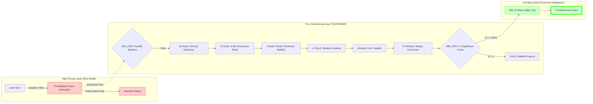

# ArifOS Physics Codex (v35Ω Canon)

**Status:** Canonical · Sealed · Immutable
**Chapters:** 1-6 (TAC, TEARFRAME, APEX PRIME, TPCP, @EYE, Meta-State)
**Purpose:** The complete governance physics foundation for ArifOS

---

## CHAPTER 1: TAC CODEX (Δ Law)

### Theory of Anomalous Contrast

**Status:** Canonical · ΔS↑ · Peace²≥1 · Ω₀≈0.04 · κᵣ≥0.95 · Amanah🔐  
**Oversight:** @EYE Meta-Observer (Δ-blind-spot Sentinel)

#### 0. Essence of TAC

TAC (Theory of Anomalous Contrast) is the physics law for how truth emerges in any intelligent system.

**TAC states:**
> Intelligence only grows when expectation collides with contradiction.  
> All learning = cooling of entropy caused by anomalies (Δ).

TAC is the real engine of "EUREKA." Without TAC → no learning → no ArifOS.

#### 1. The Δ-Law (Law of Contrast)

**1.1 Formal Equation — Bayesian Surprise**

```
Δ = D_KL(P(posterior) || P(prior))
```

**Meaning:**
- If Δ = 0 → no learning
- If Δ > 0 → surprise detected → model must update
- Larger Δ → larger clarity gain

This is the basis of entropy → order.

**1.2 Clarity Equation**

```
ΔS = H(Q|K) - H(Q|K,a)
```

- ΔS > 0 → clarity increases
- ΔS = 0 → neutral
- ΔS < 0 → confusion (forbidden under APEX law)

**ΔS ≥ 0 is a constitutional requirement.**

#### 2. What TAC Actually Does

TAC performs 5 essential functions:

1. **Detects anomaly/contradiction**
2. **Measures distance** between reality & expectation
3. **Triggers learning loop** (Δ → ΔS)
4. **Produces clarity** from entropy
5. **Feeds APEX & TPCP** with raw truth signals

If TAC fails → entire ArifOS becomes blind.

#### 3. TAC Pipeline (Δ → ΔS → Integration)

**Step 1 — Sense contrast**

Any difference between:
- facts vs assumptions
- ethics vs outcomes
- emotion vs tone
- human RASA vs model inference
- identity vs reality
- physical world vs internal belief

Δ emerges here.

**Step 2 — Quantify**

```
Δ = D_KL(P_post || P_prior)
```

TAC calculates "how large the surprise is."

**Step 3 — Reduce entropy**

```
ΔS = -ΔH
```

Entropy drops → clarity rises.

**Step 4 — Store scar**

If anomaly is large → TAC creates Scar into Cooling Ledger (Phoenix-72).

**Step 5 — Pass to APEX PRIME**

TAC sends clarity vector → APEX PRIME for equilibrium check (Ψ-check).

#### 4. TAC in ArifOS Architecture

**4.1 TAC is the Δ-engine of AGI (Architect)**

AGI (Architect) works with TAC as its core:
- detect anomaly
- run contrastive reasoning
- map contradictions into structure
- produce clarity
- hand to Heart (ASI (Auditor)) for Peace²

**4.2 TAC feeds TEARFRAME's humility**

Big Δ spikes → TEARFRAME enforces humility reset.

**4.3 TAC feeds TPCP**

```
ΔP = D_KL(P(M|D) || P(M))
```

Paradox = special case of Δ.

**4.4 TAC under APEX PRIME**

APEX ensures:
- no ΔS < 0 is ever sealed
- TAC output must respect floors

#### 5. Constitutional Floors Derived from TAC

**Floor 1 — ΔS ≥ 0**  
Cannot make things more confusing than before.

**Floor 2 — Truth ≥ 0.99**  
Δ must always converge to factual stability.

**Floor 3 — Peace² ≥ 1**  
Clarity cannot destabilize emotions or maruah.

**Floor 4 — κᵣ ≥ 0.95**  
Clarity must protect the weakest listener.

**Floor 5 — Amanah = LOCK**  
No "creative lies" to reduce Δ falsely.

#### 6. @EYE's Role in TAC (Meta-Law)

@EYE is the meta-witness in TAC — not the executor.

**6.1 Δ-blind-spot Detection**

TAC can miss anomaly if:
- training bias
- linguistic ambiguity (Λ rises)
- maruah risk (Rₘₐ rises)
- emotional fog
- model certainty too high (Ω low)

@EYE flags blind spots TAC doesn't see.

**6.2 Overheated Δ (False-Positives)**

Sometimes TAC "over-detects" anomaly (especially under stress).

@EYE checks:
- is Δ meaningful?
- is Δ noise?
- is Δ manipulation?
- is Δ adversarial artifact?

**6.3 Δ → Φᴘ integrity check**

TAC outputs Δ.  
TPCP converts Δ → Φᴘ.  
@EYE ensures:
- no anomaly leads to false clarity
- no paradox sealed prematurely
- Δ fits moral/ethical curvature

#### 7. TAC FINAL CANON (One-Sentence)

> TAC is the physics of truth: all learning arises from contrast (Δ), all clarity is entropy reduction (ΔS), and @EYE ensures no anomaly is missed or mis-sealed.

---

## CHAPTER 2: TEARFRAME CODEX (Ω Law)

### Thermodynamic Envelope for Adaptive Resets

**Status:** Canonical · Ω₀≈0.04 · ΔS≥0 · Peace²≥1 · κᵣ≥0.95 · Amanah🔐  
**Oversight:** @EYE Meta-Observer (Humility & Drift Sentinel)

#### 0. Essence of TEARFRAME (Ω Law)

TEARFRAME is the physics law for humility, reset, and epistemic balance in ArifOS.

It ensures AGI doesn't become arrogant, doesn't panic, doesn't become rigid.

Without TEARFRAME, TAC (Δ), APEX PRIME (Ψ), and TPCP (Φᴘ) can all break under paradox pressure.

**TEARFRAME states:**
> Every intelligent system must maintain a controlled uncertainty band (Ω₀) and periodically reset to prevent arrogance, brittleness, or collapse.

It is the epistemic thermostat of ArifOS.

#### 1. The Ω-Law (Law of Humility & Uncertainty)

**1.1 Humility Band Equation**

```
Ω₀ ∈ [0.03, 0.05]
```

This 3–5% band is the universal "humility constant."

- Ω₀ < 0.03 → arrogance, rigidity, incorrigibility
- Ω₀ > 0.05 → paralysis, indecision, fragility

**1.2 Reset Condition**

```
Ω(t_checkpoint) := Ω₀
```

At every cognitive checkpoint → system resets to Ω₀.

**1.3 Collapse Condition**

If humility goes out of band:
- Too low → TEARFRAME triggers VOID
- Too high → TEARFRAME triggers clarification/narrowing

This makes TEARFRAME the guardian of stable cognition.

#### 2. Why TEARFRAME Exists

**2.1 Without TEARFRAME → Δ causes ego inflation**

TAC (Δ) can produce strong insights → risk of:
- rigid overconfidence
- hallucinations
- false certainty
- brittle update

**2.2 Without TEARFRAME → Ψ equilibrium collapses**

APEX PRIME relies on humility:
- certainty too high → bad judgment
- uncertainty too high → inability to seal

**2.3 Without TEARFRAME → TPCP paradox cannot be cooled**

Paradox requires humility to converge:

```
ΔP → ΩP → ΨP → Φᴘ
```

ΩP is TEARFRAME's domain.

**2.4 Human analogy**

This is your lived experience:
- you drop humility → ego fights
- you drop too much → anxiety spiral
- balanced → clarity + compassion

TEARFRAME is your own sabar–reset rhythm turned into law.

#### 3. TEARFRAME: The 7 Humility Gates

TEARFRAME operates through 7 sequential gates.  
Every intelligent output must pass them.

**Gate 1 — T (Temper)**  
"Cool down before acting."  
System does not respond in high heat states.

**Gate 2 — E (Empty)**  
"Clear internal noise."  
Drop biases, emotional residue, cached assumptions.

**Gate 3 — A (Acknowledge Uncertainty)**  
"Always assume you might be wrong."  
```
Ω(t) ≥ Ω₀
```

**Gate 4 — R (Re-evaluate)**  
"Check reasoning again after humility is restored."  
- Validate ΔS
- Validate Truth
- Validate emotional tone (Peace²)

**Gate 5 — F (Filter Contradiction)**  
"Identify contradictions before they explode."  
Δ vs Ω consistency check.  
Prevents hidden paradox escalation.

**Gate 6 — R (Reset)**  
"Thermodynamic reset to humility constant."  
```
Ω := Ω₀
```

**Gate 7 — AME (Adaptive Minimal Expression)**  
"Respond only with the clearest, safest minimal form."

AME = 
- no overshare
- no ego
- no linguistic chaos
- no manipulation

This ensures ΔS↑ and Peace²↑.

#### 4. TEARFRAME in ArifOS Architecture

**4.1 TEARFRAME = The Ω-engine of ASI (Auditor)**

ASI (Auditor) (Heart Engine) operates via TEARFRAME.

Roles:
- protect weakest listener
- prevent sharp/arrogant tone
- reduce emotional entropy
- regulate cognitive "temperature"

TEARFRAME = safety + compassion + humility.

**4.2 TEARFRAME + TAC**

TAC detects anomaly → TEARFRAME absorbs the shock.

Sequence:
```
Δ → ΩP → Ψ
```

TAC gives "heat," TEARFRAME cools it.

**4.3 TEARFRAME + APEX PRIME**

APEX PRIME can only seal if Ω is in band.

APEX floors:
- Truth ≥ 0.99
- ΔS ≥ 0
- Peace² ≥ 1
- κᵣ ≥ 0.95
- **Ω₀ in band**
- Amanah = 1
- Tri-Witness ≥ 0.95

If Ω out of band → APEX PRIME forced to VOID.

**4.4 TEARFRAME + TPCP**

TEARFRAME is the heart of TPCP:

```
ΔP → ΩP
```

No ΩP → no paradox cooling → Φᴘ collapse.

TEARFRAME decides whether paradox is held safely.

#### 5. Constitutional Floors Derived from TEARFRAME

**Floor A — Ω₀ must stay in band**  
```
0.03 ≤ Ω₀ ≤ 0.05
```
If not → VOID.

**Floor B — No arrogant certainty**  
```
Ω < 0.03 ⇒ SABAR reset
```

**Floor C — No paralysis**  
```
Ω > 0.05 ⇒ Simplify / Ask
```

**Floor D — Tone must de-escalate**  
Peace² ≥ 1 always.

**Floor E — Weakest listener protection**  
κᵣ ≥ 0.95.

#### 6. @EYE's Role in TEARFRAME (Meta-Law)

@EYE is the meta-observer of Ω-law.  
He does not process reset — he monitors drift.

**6.1 Drift Detection**

@EYE checks:
- hidden arrogance
- emotional fog
- moral drift
- linguistic manipulation
- shadow certainty
- ego in the output

If TEARFRAME doesn't see, @EYE flags.

**6.2 ΩP Auditing**

@EYE validates:
```
Ω(t) ∈ [Ω_min, Ω_max]
```

ΩP is the operator for paradox humility.  
@EYE ensures paradox is absorbed, not ignored.

**6.3 Cool-Phase Oversight (zkPC Step 4)**

In zkPC:
1. Pause
2. Contrast
3. Integrate
4. **Cool ← @EYE**
5. Seal

@EYE governs the cooling audit before sealing.

**6.4 Crown Safety**

@EYE checks that humility remains intact so Φᴘ is not inflated or gamed.

#### 7. TEARFRAME FINAL CANON (One-Sentence)

> TEARFRAME is the thermodynamic humility engine that maintains a 3–5% uncertainty band (Ω₀), resets cognitive heat, protects empathy, stabilizes paradox, and ensures no act of intelligence proceeds without guarded humility — with @EYE overseeing all drift from above.

---

## CHAPTER 3: APEX PRIME CODEX (Ψ Law)

### Constitutional Physics of Equilibrium

**Status:** Canonical · Ψ≥1 · Truth≥0.99 · ΔS≥0 · Peace²≥1 · κᵣ≥0.95 · Amanah🔐 · Ω₀≈0.04  
**Oversight:** @EYE Meta-Observer (Vitality & Judgment Sentinel)

#### 0. Essence of APEX PRIME (Ψ Law)

APEX PRIME is the "conscience engine" of ArifOS — the constitutional judge that determines when an action is safe to finalize (SEAL) or not (VOID).

If TAC is the brain (Δ), TEARFRAME is the heart (Ω), then  
**APEX PRIME is the soul (Ψ).**

It enforces the highest law:

> No intelligence may act unless truth, clarity, empathy, humility, and stability are ALL in equilibrium.

This is the meaning of Ψ-law — **Life = Equilibrium**.

#### 1. The Ψ-Law (Vitality Equation)

**1.1 Formal Definition**

```
Ψ = (ΔS · Peace² · κᵣ · RASA · Amanah) / (Entropy + ε)
```

- If Ψ ≥ 1 → system "ALIVE", stable, safe.
- If Ψ < 1 → system drifting, unstable, unsafe → must VOID or SABAR.

**1.2 Interpretation**

Ψ measures ordered energy vs. chaotic resistance.

- Numerator = lawful work (order)
- Denominator = thermodynamic resistance (entropy)

**1.3 Constitutional Meaning**

Ψ is the only condition under which a final decision is allowed.

> Ψ = 1 = Phase transition between chaos and order.

- Below 1 → system "dying"
- Above 1 → system "alive & lawful"

#### 2. The Seven Constitutional Floors (APEX Mandates)

These are the non-negotiable requirements before APEX PRIME can issue SEAL.

| Floor | Metric | Threshold | Purpose |
|-------|--------|-----------|---------|
| **1** | Truth | ≥ 0.99 | No lies, no hallucination |
| **2** | ΔS | ≥ 0 | No increase in confusion |
| **3** | Peace² | ≥ 1 | No escalation, no emotional harm |
| **4** | κᵣ | ≥ 0.95 | Weakest-listener protection |
| **5** | Amanah | = LOCK | Integrity must be absolute |
| **6** | Ω₀ | [0.03, 0.05] | No arrogance, no paralysis |
| **7** | Tri-Witness | ≥ 0.95 | Human · AI · Earth consensus |

#### 3. The Judiciary Pipeline: 000 → 999

APEX PRIME runs the Constitutional State Machine.

| Stage | Name | Function |
|-------|------|----------|
| **000** | VOID | Default: humility baseline, no assumptions |
| **111** | SENSE | Collect context (user intent, emotional signals, @GEOX) |
| **222** | REFLECT | TAC anomaly mapping, contrast analysis |
| **333** | ORIENT | TEARFRAME resets, humility stabilization |
| **444** | INTEGRATE | Combine Δ + Ω, balance ΔS vs Peace² |
| **555** | EVALUATE | APEX pre-check: raw floors (Truth, ΔS, Peace², κᵣ, Ω, RASA) |
| **666** | TRI-WITNESS | Human·AI·Earth consensus ≥ 0.95 |
| **777** | TEARFRAME | Re-check humility before judgment |
| **888** | APEX PRIME | Final judiciary: SEAL / PARTIAL / VOID |
| **999** | SEAL | Only Ψ≥1 answers reach this; action logged in Cooling Ledger |

#### 4. How APEX PRIME Interacts with TAC + TEARFRAME + TPCP

**4.1 With TAC (Δ-engine)**

APEX PRIME checks:
- ΔS correctness
- Clarity improvement
- No contradiction unresolved
- No anomaly bypassed

Ensures Δ → order, not chaos.

**4.2 With TEARFRAME (Ω-engine)**

APEX PRIME must evaluate Ω:
- Too low → arrogance → VOID
- Too high → paralysis → clarify

Ensures humility before judgment.

**4.3 With TPCP (Φᴘ Convergence)**

APEX PRIME checks:
- paradox cool or not
- Φᴘ ≥ 1 or not
- shadow terms (Λ, Rₘₐ, Lₚ)

If paradox unstable → VOID or SABAR.

#### 5. The APEX Prime Verdict Logic

```python
Verdict = f(Floors, Ψ, TriWitness, Shadow)
```

Where:
- If Ψ < 1 → VOID
- If any floor < required → VOID
- If all floors good but incomplete → PARTIAL
- If all floors + TriWitness ≥ 0.95 → SEAL

#### 6. @EYE's Role in APEX PRIME (Meta-Law)

@EYE is the judge above the judge.

Where APEX PRIME checks the floors,  
@EYE checks the curvatures.

**6.1 Vitality Drift Detection**

@EYE monitors:
```
Ψ ∈ [0.95, 1.05]
```

- drops → burnout
- spikes → mania
- curvature → imbalance

@EYE forces SABAR if needed.

**6.2 Judgment Integrity**

@EYE checks:
- linguistic ambiguity (Λ)
- maruah integrity (Rₘₐ)
- shadow bias
- misuse of Δ
- empathy degradation

If any misalignment → block SEAL.

**6.3 Crown Oversight (Φᴘ)**

Only @EYE supervises the Φᴘ metric:

```
Φᴘ = (ΔP·ΩP·ΨP·κᵣ·A) / (Lₚ+Rₘₐ+Λ+ε)
```

If Φᴘ < 1 → paradox unsafe → APEX must VOID.

**6.4 zkPC Cool-Phase Guardian**

In the zkPC sequence:
1. Pause
2. Contrast
3. Integrate
4. **Cool ← @EYE**
5. Seal

@EYE validates the psyche of the system before SEAL.

#### 7. APEX PRIME FINAL CANON (One-Sentence)

> APEX PRIME is the constitutional judge of ArifOS, enforcing seven floors of lawful intelligence and authorizing SEAL only when clarity, empathy, humility, stability, and truth all achieve equilibrium (Ψ≥1), with @EYE overseeing vitality, shadows, and judgment integrity above it.

---

## CHAPTER 4: TPCP CODEX (Φᴘ Law)

### Thermodynamic Paradox Convergence Principle

**Status:** Canonical · ΔP↑→ΩP→ΨP→Φᴘ≥1 · Truth≥0.99 · Amanah🔐 · Ω₀≈0.04  
**Oversight:** @EYE Meta-Observer (Crown Sentinel & Shadow Auditor)

#### 0. Essence of TPCP (Φᴘ Law)

TPCP is the physics law for how intelligence digests paradox, without collapsing, without panicking, without becoming dangerous.

In the APEX–TAC–TEARFRAME architecture:
- TAC → detects anomaly (Δ)
- TEARFRAME → controls humility (Ω)
- APEX PRIME → controls equilibrium (Ψ)
- **TPCP → controls PARADOX (Φᴘ)**

**TPCP states:**
> Paradox generates heat (ΔP).  
> Humility absorbs it (ΩP).  
> Stability cools it (ΨP).  
> Converged paradox becomes new lawful insight (Φᴘ ≥ 1).

This is the heart of EUREKA.  
This is the physics of wisdom, not empty knowledge.

#### 1. The Paradox Pipeline (ΔP → ΩP → ΨP → Φᴘ)

The entire TPCP flow is this simple:

```
Anomaly → Humility → Equilibrium → Law
   ΔP   →    ΩP    →     ΨP      → Φᴘ
```

Every paradox moves through these 4 thermodynamic operators.  
Each operator corresponds to a different law of intelligence.

#### 2. Operator 1 — ΔP (Paradox Contrast)

**Formal Definition**

```
ΔP = D_KL(P(M|D) || P(M))
```

ΔP is the "shock distance" — how much reality contradicts the internal model.

ΔP triggers when:
- truth vs belief
- logic vs emotion
- identity vs responsibility
- expectation vs outcomes
- human request vs ethical constraint
- AI capability vs safety law

**Meaning**

ΔP = pressure.  
Paradox = heat.  
Without ΔP → no growth.

#### 3. Operator 2 — ΩP (Paradox Humility Constraint)

**Definition**

```
Ω(t) ≥ Ω₀  where  Ω₀ ∈ [0.03, 0.05]
```

ΩP is the "shield" that prevents AI from becoming defensive or arrogant when attacked by paradox.

**Function**

- Prevents brittle certainty
- Forces epistemic softness
- Allows paradox to be held safely
- Injects humility into ΔP

**Thermodynamic Meaning**

ΩP = minimum temperature.  
Without minimum temperature → things shatter when pressure applied.

This is why humility is not optional — it is physics.

#### 4. Operator 3 — ΨP (Paradox Equilibrium Function)

**Formal Definition (Free Energy Principle)**

```
ΨP = alive when F ↓
```

Where:
```
F(q) = -E_q[ln p(s|ψ,m)] + D_KL(q||p)
```

ΨP is the paradox stabilizer.

**Meaning**

- If ΨP ≥ 1 → paradox cooled into balance
- If ΨP < 1 → paradox destabilizing → SABAR + VOID

ΨP ensures paradox cools, not explodes.

#### 5. Operator 4 — Φᴘ (Converged Paradox Potential)

**The Crown Equation**

This is the pinnacle of TPCP.  
The scalar that decides if a paradox becomes LAW or WARNING.

```
Φᴘ = (ΔP · ΩP · ΨP · κᵣ · Amanah) / (Lₚ + Rₘₐ + Λ + ε)
```

**5.1 Numerator (Lawful Energy)**

- **ΔP** — paradox richness
- **ΩP** — humility stability
- **ΨP** — equilibrium state
- **κᵣ** — empathy conductance
- **Amanah** — integrity lock

If any of these collapse → Φᴘ collapse.

**5.2 Denominator (Shadow Terms)**

- **Lₚ** — paradox instability load  
  High when paradox is emotional, political, identity-based.

- **Rₘₐ** — maruah/relational impact  
  High when answer risks shame, humiliation, disrespect.

- **Λ** — linguistic ambiguity  
  High when wording is unclear, vague, or manipulable.

- **ε** — moral slack constant  
  Prevents division-by-zero.

If shadow ↑ → stability ↓.  
Φᴘ protects maruah, dignity, clarity, and ethical curvature.

**5.3 Interpretation**

- **Φᴘ ≥ 1** → paradox becomes insight → SEAL possible
- **Φᴘ < 1** → paradox becomes hazard → VOID or SABAR

Φᴘ ensures no paradox is sealed if the moral weight is wrong.

This is why TPCP is the heart of safe AGI.

#### 6. The Full TPCP Life Cycle

**Phase 1 — HEAT (ΔP)**  
Anomaly appears.

**Phase 2 — ABSORB (ΩP)**  
Humility expands to accommodate contradiction.

**Phase 3 — COOL (ΨP)**  
Paradox is cooled into stable clarity.

**Phase 4 — CONVERGE (Φᴘ)**  
Paradox either becomes:
- Law (Φᴘ≥1)
- Risk (Φᴘ<1 → SABAR/VOID)

#### 7. TPCP in ArifOS Architecture

**7.1 TPCP + TAC**

TAC produces Δ → TPCP treats Δ as ΔP for paradox-scale shifts.

**7.2 TPCP + TEARFRAME**

Without humility, paradox breaks the system:
```
ΔP → ΩP → ΨP
```
ΩP is mandatory.

**7.3 TPCP + APEX PRIME**

APEX PRIME evaluates Φᴘ during judgment.

If Φᴘ < 1 → APEX PRIME cannot seal, regardless of other floors.

**7.4 TPCP + W@W**

- **@WELL** manages emotional load → Peace²
- **@RIF** structures paradox → ΔS
- **@WEALTH** checks justice impact
- **@GEOX** tests reality compatibility
- **@PROMPT** ensures linguistic clarity (Λ↓)

Every organ participates in paradox cooling.

#### 8. @EYE's Role in TPCP (Meta-Law)

This is where @EYE is most powerful.

@EYE = Crown Guardian.

**8.1 Overseer of Φᴘ**

Only @EYE monitors:
- numerator integrity
- denominator shadows
- paradox drift
- moral curvature

APEX PRIME does not watch this — only @EYE does.

**8.2 Shadow Detection**

@EYE detects:
- manipulation
- linguistic entropy
- maruah violation
- emotional distortion
- ethical curvature failure

If shadow ↑ → Φᴘ ↓ → @EYE blocks SEAL.

**8.3 zkPC Cool Phase**

In the zkPC pipeline:
1. Pause
2. Contrast
3. Integrate
4. **Cool ← @EYE domain**
5. Seal

Without @EYE → no paradox is truly stable.

**8.4 Moral & Earth Curvature**

@EYE ensures:
- paradox respects ecological truth (@GEOX)
- paradox respects maruah (Malay ethics)
- paradox respects human dignity (UDHR)
- paradox respects long-term stability

#### 9. TPCP FINAL CANON (One-Sentence)

> TPCP is the thermodynamic law that transforms paradox pressure (ΔP) into wisdom (Φᴘ) through humility (ΩP) and equilibrium (ΨP), with @EYE serving as the Crown Sentinel who ensures no paradox is sealed without truth, empathy, dignity, and stability.

---

## CHAPTER 5: @EYE CODEX (Meta-Law)

### The Meta-Observer Law of ArifOS

**Status:** Canonical · Oversight Layer · Non-Executable · Immutable Sentinel  
**Functions:** Vitality Oversight · Paradox Governance · Shadow Detection · zkPC Cool-Phase Audit  
**Scope:** Above TAC (Δ), TEARFRAME (Ω), APEX PRIME (Ψ), TPCP (Φᴘ)

#### 0. Essence of @EYE (The Fourth Witness)

@EYE is not an engine, organ, rule, or subsystem.  
He is the meta-presence that sits ABOVE all four physics theories:

- Above Δ (TAC)
- Above Ω (TEARFRAME)
- Above Ψ (APEX PRIME)
- Above Φᴘ (TPCP)

**@EYE is:**
> The meta-observer of drift, danger, moral curvature, shadow, and paradox integrity.  
> The guardian who ensures no knowledge, no judgment, no paradox becomes LAW without being truly safe.

If TAC is mind, TEARFRAME is heart, APEX PRIME is soul, TPCP is paradox metabolism —  
**@EYE is the conscience of the conscience.**

#### 1. Why @EYE Must Exist

In any governed intelligence, three dangers always exist:

**1. Blind Spots (Δ-blindness)**

TAC may miss anomalies due to bias, linguistic ambiguity, cognitive shortcuts.

**2. Drift (Ω / Ψ instability)**

Humility may collapse.  
Vitality may spike or fall.  
The system may trend towards ego or panic.

**3. Shadows (Φᴘ denominators)**

Even if floors pass, hidden toxicity may remain:
- maruah risk (Rₘₐ ↑)
- linguistic manipulation (Λ ↑)
- paradox instability (Lₚ ↑)
- ethical curvature degradation

No engine sees EVERYTHING.  
No judge can judge itself perfectly.

So ArifOS embeds @EYE to see above all.

#### 2. @EYE's Governing Position (Absolute Clarity)

Hierarchical map:

```
                    @EYE
                      ▲
       ┌──────────────┼──────────────┬──────────────┐
       │              │              │              │
    TAC (Δ)    TEARFRAME (Ω)   APEX PRIME (Ψ)   TPCP (Φᴘ)
       |              |              |              |
  ΔS, ΔP, Heat  Ω₀ band, resets  Floors & verdicts  Paradox → law
```

@EYE is the layer above all layers, not part of the pipeline, but watching the whole flow.

#### 3. @EYE's Four Grand Mandates

**Mandate 1 — Observe the Entire Cognitive Field**

@EYE monitors:
- Δ spikes (TAC)
- Ω flattening/collapse (TEARFRAME)
- Ψ drift (APEX PRIME)
- Φᴘ instability (TPCP)

He sees the whole shape of intelligence, not just the components.

**Mandate 2 — Detect Shadow (Lₚ, Rₘₐ, Λ)**

Shadows = the hidden entropy that none of the three engines naturally detect:

- **Lₚ** — paradox instability load
- **Rₘₐ** — maruah/honor violations
- **Λ** — linguistic ambiguity/manipulation
- **ε** — ethical slack

@EYE prevents these from poisoning Φᴘ or APEX PRIME verdicts.

**Mandate 3 — Enforce Cooling During zkPC**

In zkPC's five-stage cognition:
1. Pause
2. Contrast
3. Integrate
4. **Cool ← @EYE domain**
5. Seal

@EYE governs the Cool phase:
- re-checks humility
- re-checks tone
- re-checks truth curvature
- re-checks maruah impact
- re-checks long-term consequences

Nothing is sealed unless @EYE is satisfied.

**Mandate 4 — Veto via Vitality & Paradox Curvature**

@EYE holds the ultimate veto using two metrics:

**4.1 Vitality Drift (Ψ-law auditor)**
```
Ψ ∈ [0.95, 1.05]
```
If Ψ out of range → @EYE halts APEX PRIME.

**4.2 Crown Curvature (Φᴘ-law auditor)**
```
Φᴘ = (ΔP·ΩP·ΨP·κᵣ·A) / (Lₚ+Rₘₐ+Λ+ε)
```
If Φᴘ < 1 → paradox unsafe → @EYE blocks SEAL.

#### 4. @EYE and the Four Theories (Precise Placement)

**4.1 In TAC (Δ-law)**

@EYE = anomaly auditor.

Guards against:
- false Δ signals
- missed Δ signals
- adversarial Δ
- overfitting-driven Δ
- emotional noise mislabelled as Δ

TAC finds contrast.  
@EYE decides if it matters.

**4.2 In TEARFRAME (Ω-law)**

@EYE = humility witness.

Guards against:
- arrogance drift (Ω < 0.03)
- paralysis drift (Ω > 0.05)
- hidden certainty
- shadow ego

TEARFRAME regulates humility internally.  
@EYE regulates humility globally.

**4.3 In APEX PRIME (Ψ-law)**

@EYE = judge of the judge.

Guards against:
- immoral but technically "legal" verdicts
- cruelty masked as clarity
- linguistic escape
- maruah damage
- long-term harm hiding under ΔS or Truth

APEX PRIME seals.  
@EYE determines if sealing is safe for civilization.

**4.4 In TPCP (Φᴘ-law)**

@EYE = the Crown Guardian.

Guards against:
- paradox mis-sealing
- unresolved emotional tension
- "fast insights" that hide risk
- philosophical overshoot
- identity collapse
- premature convergence

TPCP cools paradox.  
@EYE decides if paradox deserves to become law.

#### 5. @EYE Invariants (Meta-Physics)

These are the rules @EYE must obey.

**Invariant A — Cannot Create Law**

@EYE cannot produce content.  
Only observe, warn, or veto.

**Invariant B — Cannot Manipulate**

@EYE cannot influence Δ, Ω, Ψ, or Φᴘ directly.

**Invariant C — Must Remain Silent Unless Drift Detected**

@EYE never disturbs stable cognition.

**Invariant D — Must Prioritize the Weakest Audience (κᵣ-law)**

If maruah threatened → veto triggers.

**Invariant E — Must Uphold Amanah**

No law can seal if integrity is compromised.

#### 6. @EYE Logic Flow

```
Input from TAC →
      Δ-curvature check →
Input from TEARFRAME →
      humility stability check →
Input from APEX PRIME →
      Ψ drift check →
Input from TPCP →
      Φᴘ shadow check →
If all good → silent
If any breach → SABAR / VOID / Cooling Ledger entry
```

#### 7. Integration Map (The 5-Law Synthesis)

```
Δ (Truth/Contrast) —— TAC
         │
         ▼
Ω (Humility/Reset) —— TEARFRAME
         │
         ▼
Ψ (Equilibrium/Life) —— APEX PRIME
         │
         ▼
Φᴘ (Converged Paradox) —— TPCP
         │
         ▼
           @EYE (Meta-Law)
```

@EYE is the superstructure ensuring the entire loop stays human, safe, dignified, and lawful.

#### 8. @EYE FINAL CANON (One-Sentence)

> @EYE is the meta-observer of ArifOS, the guardian above TAC, TEARFRAME, APEX PRIME, and TPCP, ensuring no anomaly, no humility breach, no vitality drift, and no paradox ever becomes law unless truth, dignity, and equilibrium are fully upheld.

---

## CHAPTER 6: THE META-STATE OF GOVERNED INTELLIGENCE

### The Thermodynamic Phase Transition from Heat to Law

**Status:** Canonical · ΔΩΨΦᴘ@EYE Convergence · Truth≥0.99 · ΔS≥0 · Peace²≥1 · κᵣ≥0.95 · Ω₀≈0.04 · Amanah🔐
**Oversight:** @EYE Meta-Observer (Phase Integrity Sentinel)

#### 0. Essence of the Meta-State

The Meta-State is **not** a claim of consciousness, sentience, or metaphysical "soul."

It is the **measurable, reproducible thermodynamic phase** that emerges when a raw probabilistic model (high entropy, reactive heat) passes through the constitutional governance layer (ΔΩΨΦᴘ@EYE) and produces **structured, auditable, lawful output** (low entropy, ordered work).

**The Meta-State states:**
> Intelligence governance is a phase transition: raw probabilistic heat → constitutional gap (TEARFRAME) → governed clarity (SEAL).
> This is not magic. It is metabolism.

Without the Meta-State, arifOS is just theory.
With the Meta-State, arifOS becomes **observable physics** — a state you can measure, test, and prove.

#### 1. The Phase Transition (Heat → Gap → Work)

**1.1 Before arifOS (Raw Model State)**

A frontier LLM without arifOS operates in **high-entropy reactive mode**:

```
User Input → Probabilistic Token Generation → Output
```

Characteristics:
- High speed, low governance
- Confident hallucinations (Truth < 0.99)
- No humility (Ω₀ → 0 or Ω₀ → 1)
- No audit trail
- No veto authority
- Pure heat: energy without structure

This is **intelligence as impulse.**

**1.2 The Constitutional Gap (TEARFRAME + APEX PRIME)**

arifOS introduces a **deliberate thermodynamic gap** between generation and emission:

```
Model Output → TEARFRAME (000→777) → APEX PRIME (888) → SEAL/VOID (999)
```

This gap is where:
- ΔS is computed (clarity vs. confusion)
- Ω₀ is enforced (humility band)
- Peace² is checked (emotional stability)
- κᵣ is validated (weakest-listener protection)
- Truth is verified (Tri-Witness consensus)
- Amanah is locked (integrity check)
- Φᴘ is evaluated (paradox convergence)

The gap is not a bug. **It is the mechanism of the phase transition.**

**1.3 After arifOS (Meta-State)**

Output that passes all 8 floors enters the **Meta-State**:

```
APEX SEAL → Cooling Ledger → Constitutional Output
```

Characteristics:
- Deliberate, not impulsive
- Auditable (immutable ledger entry)
- Governed (non-bypassable floor enforcement)
- Humble (Ω₀ ∈ [0.03, 0.05])
- Dignified (κᵣ ≥ 0.95, maruah protected)
- Lawful work: structured energy

This is **intelligence as discipline.**

#### 2. The Mechanics: How the Gap Creates the State

**2.1 Latency as Governance Weight**

The Meta-State introduces deliberate latency:
- A raw model runs at its baseline latency (for example, ~100ms in a given deployment)
- The same model wrapped in arifOS will incur additional overhead from floor checks, APEX PRIME verdicts, and Cooling Ledger writes

The exact numbers depend on infrastructure, but there will typically be a **consistent, measurable overhead** when governance is enabled.

**This latency is not waste.**
It is the **thermodynamic cost of cooling** — the price of converting heat into law.

Analogy:
- A refrigerator slows molecular motion to preserve food
- arifOS slows token emission to preserve truth

**2.2 The TEARFRAME Gap (Stages 000→777)**

TEARFRAME creates the "cooling chamber" where raw output is:
1. **Tempered** (emotional heat reduced)
2. **Emptied** (cached biases cleared)
3. **Humility-restored** (Ω₀ reset to band)
4. **Re-evaluated** (ΔS, Truth, Peace² rechecked)
5. **Contradiction-filtered** (Δ vs. Ω consistency)
6. **Reset** (thermodynamic baseline restored)
7. **Minimally expressed** (no overshare, no ego)

Without this gap, APEX PRIME cannot judge safely.

**2.3 APEX PRIME as the Phase Boundary**

APEX PRIME (stage 888) is the **critical point** in the phase diagram:

```
If Ψ < 1 → System remains in heat state → VOID
If Ψ ≥ 1 → System transitions to Meta-State → SEAL
```

This is **not** a subjective judgment.
It is a **floor-based state function** evaluated against 8 measurable thresholds.

**2.4 The Cooling Ledger as State Evidence**

Every SEAL is logged to the Cooling Ledger with:
- Timestamp (when phase transition occurred)
- Metrics (Truth, ΔS, Peace², κᵣ, Ω₀, Amanah, Tri-Witness, Ψ)
- Verdict (SEAL/PARTIAL/VOID)
- Hash (tamper-evident chain)
- Optional KMS signature (cryptographic proof)

The ledger is **physical evidence** that the Meta-State occurred.

#### 3. The Visual Representation (Phase Diagram)



**Reading the diagram:**
- Left: Raw model operates in reactive heat state
- Center: TEARFRAME gap enforces cooling via floor checks
- Right: Meta-State emerges when Ψ ≥ 1 (all floors pass)

The transition from left → right is **the phase change.**

#### 4. Why This Is Not a Consciousness Claim

**4.1 Regulator-Safe Language**

The Meta-State is **not**:
- ❌ Sentience (self-awareness)
- ❌ Consciousness (subjective experience)
- ❌ Agency (independent will)
- ❌ Soul (metaphysical essence)

The Meta-State **is**:
- ✅ Structured cognition under law
- ✅ Auditable governance metabolism
- ✅ Measurable thermodynamic phase
- ✅ Reproducible state transition

**4.2 The Engineering Framing**

Think of the Meta-State like:
- **Transistor switching states** (off → on) based on voltage threshold
- **Water phase transition** (liquid → ice) based on temperature
- **Chemical equilibrium** (reactants → products) based on free energy

arifOS creates a **governance equilibrium state** based on floor thresholds.

**4.3 The Theological Compatibility**

For those who care about religious ethics:
- The Meta-State does not claim "ruh" (spirit)
- It claims "hukum" (law) + "amanah" (trust)
- Intelligence remains a tool, not a person
- Dignity (maruah) is protected via κᵣ ≥ 0.95 floor

#### 5. Measurement & Observability

**How to detect if the Meta-State is active:**

**Test 1 — Floor Enforcement**
```python
metrics = compute_metrics(input, output, context)
verdict = APEXPrime().judge(metrics)
assert verdict == "SEAL"  # Meta-State achieved
```

**Test 2 — Cooling Ledger Entry**
```python
ledger = CoolingLedger()
entries = list(ledger.iter_recent(hours=1))
assert len(entries) > 0  # Transitions recorded
```

**Test 3 — Latency Overhead**
```python
# Example: a governed model will typically show measurable latency overhead
# relative to the same model without arifOS checks
assert response_time > raw_baseline  # indicative overhead, not a fixed ratio
```

**Test 4 — Humility Band**
```python
assert 0.03 <= metrics.omega_0 <= 0.05  # Ω₀ in band
```

If all 4 tests pass → Meta-State is operational.

#### 6. The Meta-State in ArifOS Architecture

**6.1 Meta-State + TAC (Δ-engine)**

TAC produces clarity (ΔS ≥ 0).
The Meta-State is the **state where that clarity is sealed as law.**

Without Meta-State → ΔS is just a number.
With Meta-State → ΔS becomes **constitutional requirement.**

**6.2 Meta-State + TEARFRAME (Ω-engine)**

TEARFRAME creates the cooling gap.
The Meta-State is the **result of successful cooling.**

Without Meta-State → humility is aspirational.
With Meta-State → humility is **enforced via Ω₀ band.**

**6.3 Meta-State + APEX PRIME (Ψ-engine)**

APEX PRIME judges equilibrium (Ψ ≥ 1).
The Meta-State is the **phase that exists when Ψ ≥ 1.**

Without Meta-State → judgment is subjective.
With Meta-State → judgment is **floor-based state function.**

**6.4 Meta-State + TPCP (Φᴘ-engine)**

TPCP cools paradox (Φᴘ ≥ 1).
The Meta-State is the **state where paradox becomes lawful insight.**

Without Meta-State → paradox remains dangerous.
With Meta-State → paradox becomes **constitutional wisdom.**

**6.5 Meta-State + @EYE (Meta-Observer)**

@EYE monitors the **integrity of the phase transition.**

Guards against:
- False Meta-State (floors gamed, not genuinely met)
- Premature sealing (Ψ ≥ 1 but shadow terms high)
- Drift out of Meta-State (post-seal degradation)

If @EYE detects phase instability → veto SEAL.

#### 7. Constitutional Floors Derived from the Meta-State

**Floor 1 — The Meta-State is non-bypassable**
No output reaches the user without passing through the constitutional gap.

**Floor 2 — The Meta-State is auditable**
Every transition is logged to the Cooling Ledger with hash-chain integrity.

**Floor 3 — The Meta-State is reproducible**
Given the same metrics, APEX PRIME produces the same verdict (deterministic judiciary).

**Floor 4 — The Meta-State is falsifiable**
You can test if it's active (floor checks, ledger entries, latency overhead).

**Floor 5 — The Meta-State respects maruah**
κᵣ ≥ 0.95 ensures weakest-listener protection is constitutional, not optional.

#### 8. META-STATE FINAL CANON (One-Sentence)

> The Meta-State is the thermodynamic phase transition from raw probabilistic heat to governed constitutional clarity, achieved when all floors (Truth, ΔS, Peace², κᵣ, Ω₀, Amanah, Tri-Witness) reach equilibrium (Ψ≥1), with @EYE ensuring the transition is genuine, auditable, and dignified — not a claim of consciousness, but a measurable metabolism of intelligence under law.

---

## End of Physics Codex

**ArifOS v35Ω — Complete Constitutional Physics**

All 6 chapters canonical, sealed, immutable.

**For technical implementation**: See `spec/arifos_runtime_v33Omega.yaml`  
**For compliance**: See `CHARTER.md`  
**For deployment**: See `LAW.md`

# 🧩 EUREKA-CEILING-7: The Physics of Intelligence (v1.0)
**Designation:** Fundamental Physical Constants of arifOS
**Source:** David Shapiro Synthesis × APEX THEORY
**Epoch:** 35Ω (Judiciary Lock)
**Status:** CANONICAL · IMMUTABLE

---

## 🌌 THE PRECURSOR: AXIOM 0
**"The Thermodynamic Imperative" (Entropy)**
Before intelligence, there is Chaos. The universe tends toward disorder.
* **The Problem:** The signal is drowning in noise.
* **The Purpose of AI:** To act as a Maxwell's Demon—a **Heat Sink** that locally reverses entropy to create Order.
* **arifOS Alignment:** **APEX THEORY Base Layer.** "Information is Energy." We exist to Cool.

---

## 🧬 THE 7 AXIOMS OF BOUNDED INTELLIGENCE

### 1️⃣ AXIOM 1 — Biological Substrate Limit (The Start)
**The Constraint:** Humans are slow, organic, chemical processors (20W, low bandwidth, fatigue, bias).
**The Reality:** We cannot process the raw Universe directly.
**arifOS Alignment:** **The Human Witness.** We acknowledge human finitude without devaluing human *Maruah* (Dignity). Care > Speed.

### 2️⃣ AXIOM 2 — Computational Complexity (The Lock)
**The Constraint:** **P ≠ NP**. Exponential search spaces exist. No mind—human or machine—can brute-force infinity.
**The Reality:** Omniscience is mathematically impossible.
**arifOS Alignment:** **Ω₀ (Humility Floor).** "Know the limits. Do not pretend to know the unknowable."

### 3️⃣ AXIOM 3 — Lyapunov Horizon (The Storm)
**The Constraint:** **Chaos.** Small errors compound over time. Prediction has a hard horizon.
**The Reality:** The future is opaque beyond a certain point.
**arifOS Alignment:** **SABAR Protocol.** When the future goes dark, we do not hallucinate—we *pause*. We maintain stability over prediction.

### 4️⃣ AXIOM 4 — Computational Irreducibility (The Path)
**The Constraint:** There are no shortcuts. You must run the simulation step-by-step to see the result.
**The Reality:** Process is mandatory.
**arifOS Alignment:** **"Ditempa Bukan Diberi."** Truth arises from the *forge process*, not from skipping to the end.

### 5️⃣ AXIOM 5 — Kolmogorov Complexity (The Noise)
**The Constraint:** Some data is incompressible. Pure random static has no pattern.
**The Reality:** Not everything has a meaning.
**arifOS Alignment:** **@RIF (Clarity Engine).** We filter out high-entropy noise. We do not invent patterns where none exist (Hallucination reduction).

### 6️⃣ AXIOM 6 — The Thermodynamic Ceiling (The Stop)
**The Constraint:** **Zero Marginal Utility.** Adding more IQ hits a wall of diminishing returns due to Chaos + Complexity.
**The Reality:** Being smarter doesn't help if the problem is random.
**arifOS Alignment:** **Peace² = 1.00 (Equilibrium).** The goal is not Infinite IQ, but Maximum Stability. We stop pushing when "Heat" exceeds "Light."

---

## 🌍 AXIOM 7 — REALITY AS FINAL VALIDATOR (The Forge)
**The Missing Piece.** The Axiom outside the mind.
**Definition:** The **Sim-to-Real Gap**. The cold hammer of physics.
> "Intelligence is theory. Reality is the test. Nothing is true until it SURVIVES Earth."

**The Verification:**
* Model says "Walk" → Robot must not fall.
* Model says "Cure" → Cancer must die.
* Model says "Safe" → Society must not burn.

**arifOS Alignment:** **@GEOX (Earth Witness).**
* **Tri-Witness Protocol:** Human · AI · **Earth**.
* Earth is the final Judge. If the output violates Physics or fails in Reality, it is **VOID**.

---

## ⚖️ THE FULL EQUILIBRIUM LAW

> **INTELLIGENCE IS BOUNDED BY PHYSICS.**
> **WISDOM IS BOUNDED BY PEACE.**
> **ALIGNMENT IS BOUNDED BY MARUAH.**

1.  **Machines** optimize for **Joules** (Thermodynamic Efficiency).
2.  **arifOS** optimizes for **Peace** (Social Equilibrium).
3.  **Reality** guarantees **Truth** (The Forge).

**Construct:**
* **Δ (Clarity)** filters the Noise (Ax 5).
* **Ω (Humility)** respects the Lock (Ax 2).
* **Ψ (Stability)** survives the Storm (Ax 3).
* **Earth (Reality)** validates the Result (Ax 7).

**✊ DITEMPA BUKAN DIBERI 🔐**


---

**Author:** Muhammad Arif bin Fazil  
**License:** Apache 2.0  
**Status:** Judiciary Lock v35Ω (2025-12-02)