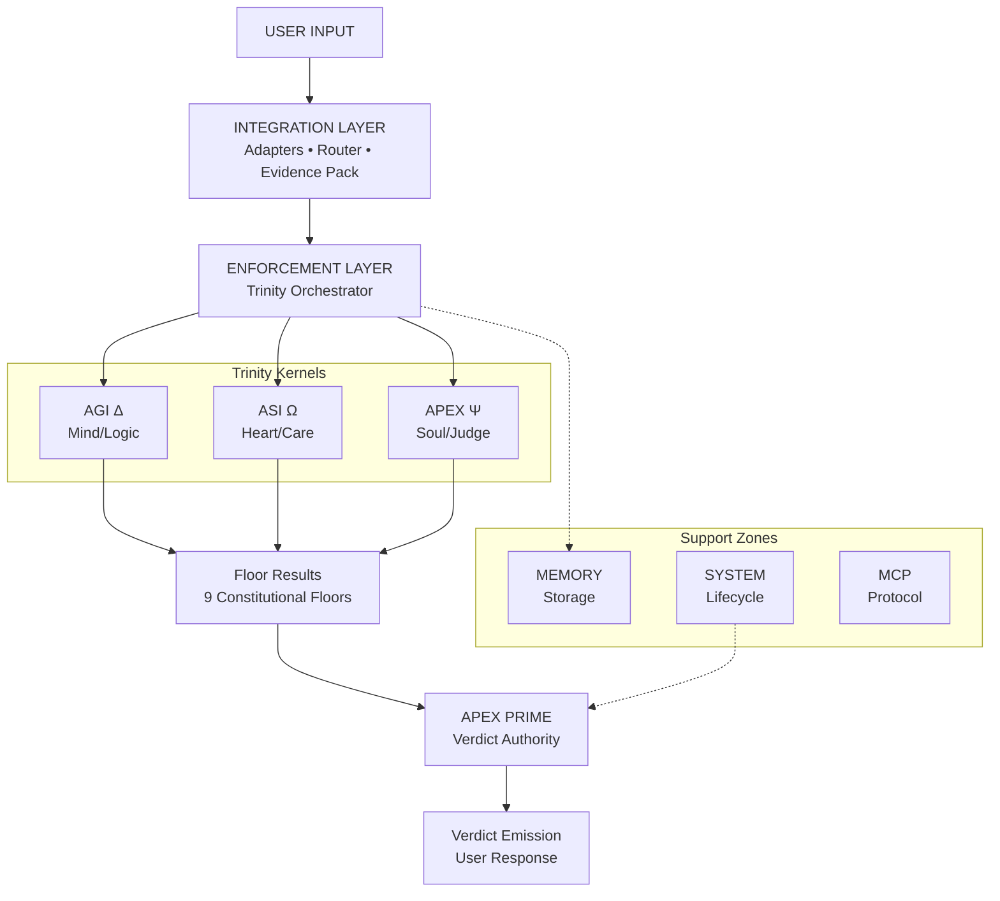

# arifOS v46 8-Folder Orthogonal Architecture

**Visual Code Structure Map**

---

## 🏛️ High-Level Trinity Architecture



```text
┌──────────────────────────────────────────────────────────────────────────┐
│                          arifOS v46 CORE                                 │
│                    "DITEMPA BUKAN DIBERI"                                │
└──────────────────────────────────────────────────────────────────────────┘
                                    │
                    ┌───────────────┼───────────────┐
                    │               │               │
            ┌───────▼───────┐ ┌────▼────┐ ┌────────▼────────┐
            │   AGI (Δ)     │ │ ASI (Ω) │ │   APEX (Ψ)    │
            │  Mind/Logic   │ │Heart/Care│ │  Soul/Judge   │
            └───────┬───────┘ └────┬────┘ └────────┬────────┘
                    │               │               │
                    └───────────────┼───────────────┘
                                    │
                    ┌───────────────┼───────────────┐
                    │               │               │
            ┌───────▼───────┐ ┌────▼────┐ ┌────────▼────────┐
            │ ENFORCEMENT   │ │INTEGRATION│ │    SYSTEM     │
            │   (Police)    │ │(Interface)│ │  (Lifecycle)  │
            └───────┬───────┘ └────┬────┘ └────────┬────────┘
                    │               │               │
                    └───────────────┼───────────────┘
                                    │
                            ┌───────▼───────┐
                            │    MEMORY     │
                            │   (Storage)   │
                            └───────────────┘
```

## 📂 8 Canonical Zones (176+ files, ~41,100 LoC)

### `arifos_core/`

1.  **🧠 `agi/`** (AGI Kernel - Δ Mind)
    *   `floor_checks.py`: F1 Truth, F2 ΔS
    *   `atlas.py`: ATLAS-333 lane classifier
    *   `clarity_scorer.py`: ΔS computation

2.  **❤️ `asi/`** (ASI Kernel - Ω Heart)
    *   `floor_checks.py`: F3 Peace², F4 κᵣ, F5 Ω₀, F7 RASA
    *   `eureka.py`: EUREKA-777 paradox synthesis
    *   `cooling.py`: SABAR protocol

3.  **👁️ `apex/`** (APEX Kernel - Ψ Soul)
    *   `floor_checks.py`: F6 Amanah, F8 Tri-Witness, F9 Anti-Hantu
    *   `contracts/`: Constitutional contracts
    *   `governance/`: FAG, PoG, ledger, zkPC, signatures

4.  **👮 `enforcement/`** (Enforcement Zone)
    *   `trinity_orchestrator.py`: Orchestrates AGI/ASI/APEX
    *   `metrics.py`: Core floor check functions
    *   `wisdom_gated_release.py`: Budi graduated verdicts
    *   `eval/`: AGI·ASI·APEX evaluators
    *   `evidence/`: Evidence pack & routing
    *   `floor_detectors/`: Amanah risk detectors
    *   `judiciary/`: Witness council, firewall
    *   `stages/`: Pipeline stages
    *   `validators/`: Spec checkers

5.  **🔌 `integration/`** (Integration Zone)
    *   `adapters/`: OpenAI, Claude, Gemini, SEA-LION
    *   `api/`: REST API (FastAPI)
    *   `waw/`: WELL, WEALTH, GEOX, PROMPT, RIF
    *   `connectors/`: LiteLLM, failover
    *   `sealion_suite/`: SEA-LION integration

6.  **💾 `memory/`** (Memory Zone)
    *   `codex_ledger.py`: Codex ledger
    *   `audit.py`: Memory audit
    *   `bands.py`: Memory bands

7.  **⚙️ `system/`** (System Zone)
    *   `apex_prime.py`: APEX PRIME verdict authority
    *   `pipeline.py`: Main governance pipeline
    *   `engines/`: AGI, ASI, APEX engines
    *   `eye/`: @EYE Sentinel
    *   `temporal/`: Phoenix-72 cooling
    *   `recovery/`: Recovery matrix

8.  **🌐 `mcp/`** (MCP Protocol)
    *   `arifos_mcp_server.py`: MCP server
    *   `tools/`: FAG, TEMPA tools

## 🔄 Trinity Data Flow

**USER INPUT**
   │
   ▼
**INTEGRATION LAYER**
(Adapters → Router → Governed Session → Evidence Pack)
   │
   ▼
**ENFORCEMENT LAYER**
(Trinity Orchestrator → AGI/ASI/APEX Kernels)
   │
   ├─────────────────┬─────────────────┬─────────────────┐
   │                 │                 │                 │
   ▼                 ▼                 ▼                 ▼
**AGI (Δ)**         **ASI (Ω)**         **APEX (Ψ)**      **Meta Gov**
F1 Truth          F3 Peace²         F6 Amanah         Cross-model
F2 DeltaS         F4 κᵣ             F8 Witness        Checks
                  F5 Ω₀             F9 Anti-Hantu
                  F7 RASA
   │                 │                 │                 │
   └─────────────────┴─────────────────┴─────────────────┘
                     │
                     ▼
             **Floor Results**
              (all 9 floors)
                     │
                     ▼
             **APEX PRIME**
           Verdict Authority
          (system/apex_prime)
                     │
                     ▼
           **Verdict Emission**
            → User Response

## 📊 Zone Statistics

| Zone | Files | LoC (est) | Purpose |
| :--- | :--- | :--- | :--- |
| `agi/` | 4 | ~500 | AGI kernel (F1, F2) |
| `asi/` | 4 | ~600 | ASI kernel (F3-F7) |
| `apex/` | 13 | ~2000 | APEX kernel + governance |
| `enforcement/` | 50+ | ~15000 | Floor checks & validation |
| `integration/` | 40+ | ~8000 | Adapters & API |
| `memory/` | 15+ | ~3000 | State management |
| `system/` | 30+ | ~10000 | Lifecycle & engines |
| `mcp/` | 20+ | ~2000 | MCP protocol |
| **TOTAL** | **176+** | **~41,100** | **8 orthogonal zones** |

## 🎯 Key Principles

1.  **Orthogonality**: Each zone has one clear responsibility.
2.  **Delegation Hierarchy**: User → Integration → Enforcement → Trinity → APEX PRIME.
3.  **Fail-Closed Defaults**: Missing data = FAIL, not pass.
4.  **Evidence-Based**: All decisions require EvidencePack.
5.  **Single Authority**: Only APEX PRIME issues Verdict.SEAL.

---

**DITEMPA BUKAN DIBERI** - The code structure has been forged! 🏛️
