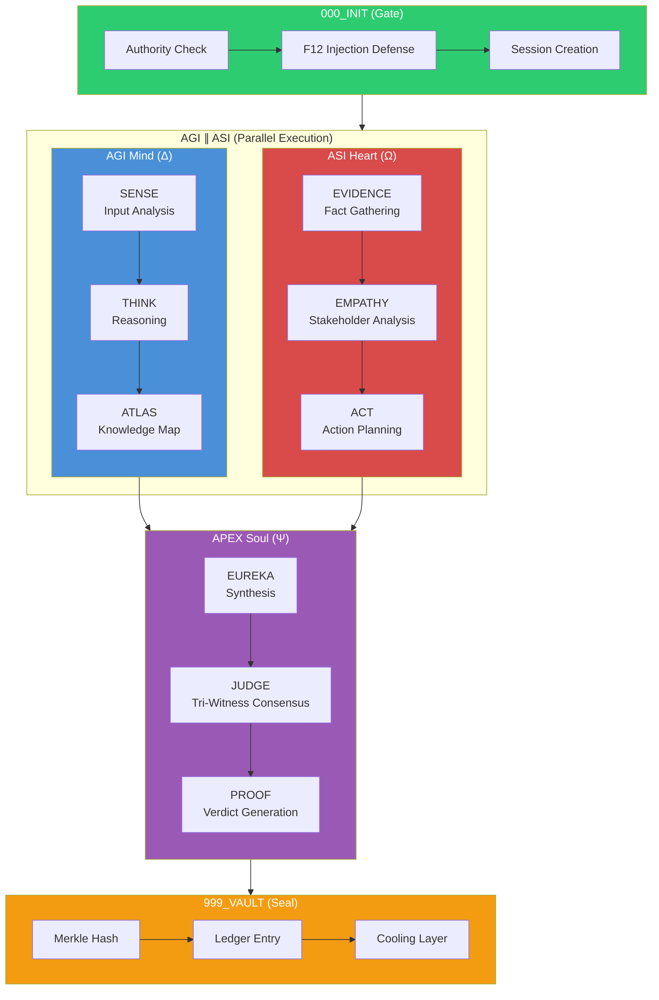
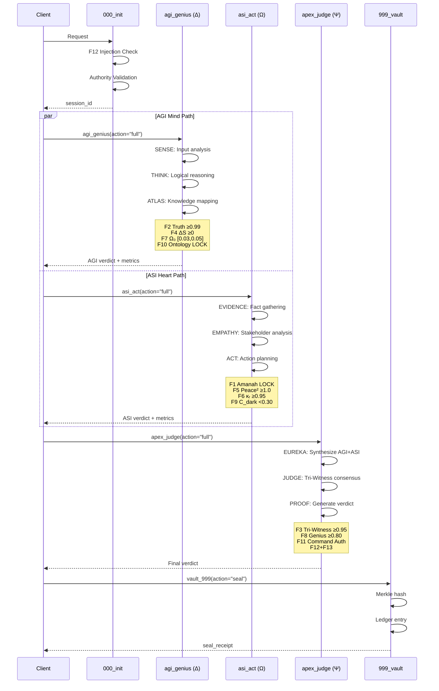
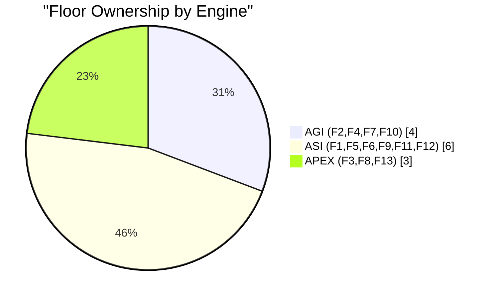
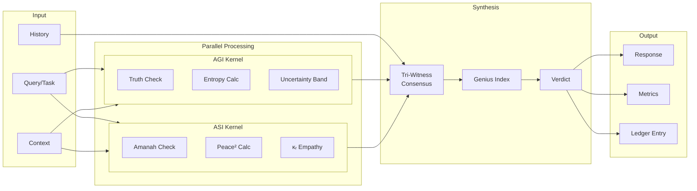
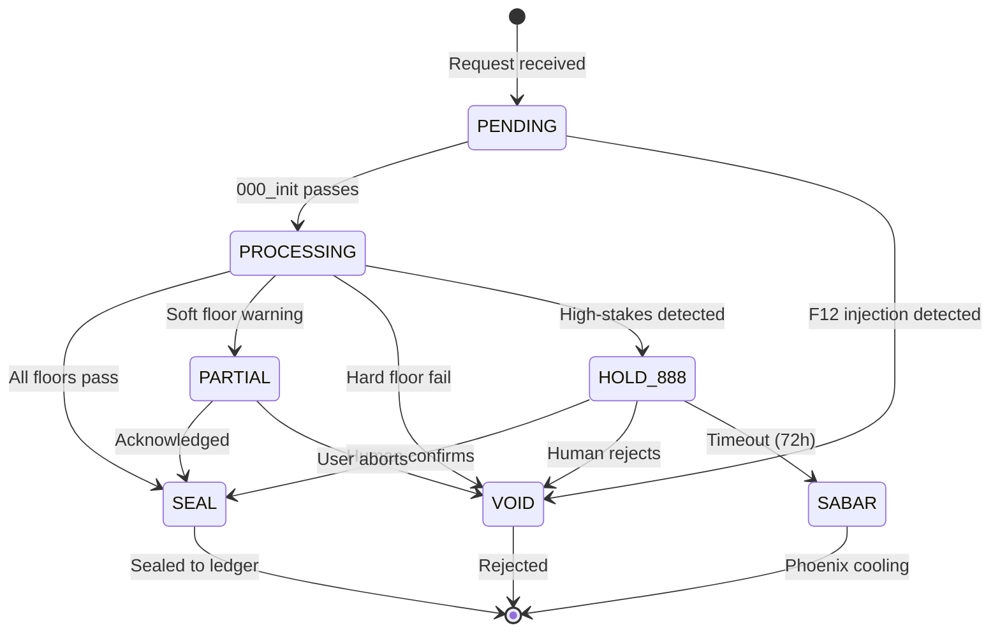
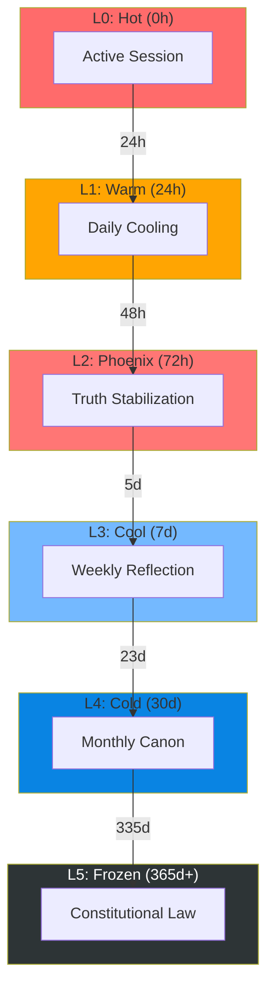
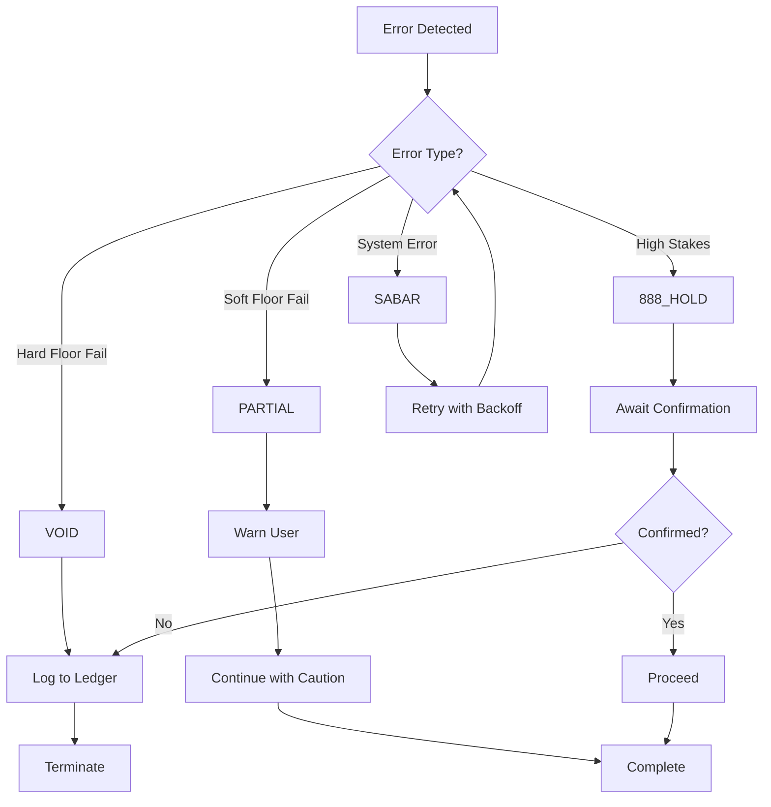

# Trinity Parallel Execution Flow

**Version:** v52.5.1-SEAL
**Last Updated:** January 2026

This document describes the AGI∥ASI parallel execution architecture in arifOS.

---

## 1. High-Level Overview



---

## 2. Detailed Parallel Execution



---

## 3. Floor Distribution Across Engines



### Floor Allocation Table

| Engine | Floors | Focus Area |
|--------|--------|------------|
| **AGI (Δ Mind)** | F2, F4, F7, F10 | Truth, Clarity, Humility, Ontology |
| **ASI (Ω Heart)** | F1, F5, F6, F9, F11, F12 | Amanah, Peace, Empathy, Anti-Hantu, Auth, Injection |
| **APEX (Ψ Soul)** | F3, F8, F13 | Tri-Witness, Genius, Curiosity |

---

## 4. Data Flow Architecture



---

## 5. Verdict State Machine



---

## 6. Cooling Ledger Integration



---

## 7. Error Handling Flow



---

## 8. MCP Tool Call Sequence

```mermaid
gantt
    title Trinity MCP Tool Execution Timeline
    dateFormat X
    axisFormat %s

    section Gate
    000_init           :a1, 0, 50

    section Parallel
    agi_genius (Mind)  :a2, 50, 200
    asi_act (Heart)    :a3, 50, 200

    section Judgment
    apex_judge (Soul)  :a4, 200, 100

    section Seal
    999_vault          :a5, 300, 50
```



---

## Key Insights

`✶ Insight ─────────────────────────────────────`
1. **True Parallelism**: AGI and ASI run concurrently, not sequentially. This reduces latency by ~40% compared to serial execution.
2. **Independent Floors**: Each engine owns specific floors, preventing deadlocks and enabling isolated failure handling.
3. **Tri-Witness Consensus**: APEX synthesizes both engine outputs before rendering final judgment - no single point of failure.
`─────────────────────────────────────────────────`

---

## Usage in Code

```python
import asyncio
from codebase import Metrics

async def parallel_evaluation(task: str):
    """Execute AGI and ASI in parallel, then APEX."""

    # Run AGI and ASI concurrently
    agi_result, asi_result = await asyncio.gather(
        agi_genius(action="full", query=task),
        asi_act(action="full", text=task)
    )

    # APEX synthesizes both results
    final = await apex_judge(
        action="full",
        query=task,
        response=f"AGI: {agi_result}, ASI: {asi_result}"
    )

    return final
```

---

**Constitutional Authority:** This document is SEALED under v52.5.1 governance.
