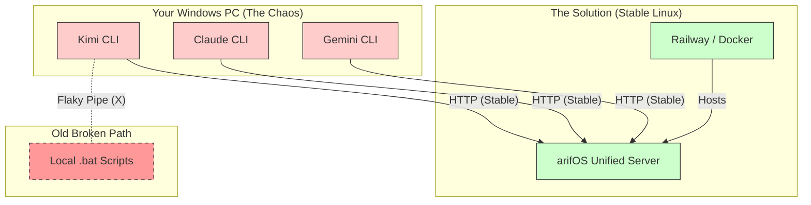

# arifOS v49 Implementation Map: The Path to Stability

**The Problem: "The Windows Pipe Mess"**
You are trying to run a complex Linux-native server (arifOS MCP) directly on Windows using batch scripts (`.bat`) and local pipes (`|`).
- **Why it fails:** Windows pipes are fragile. If the server prints one extra line of text (logs, warnings), the pipe breaks ("Connection closed").
- **Symptoms:** Kimi crashes, Claude fails, Gemini hangs (waiting for pipe).

**The Solution: "The Container Vessel" (Docker/Railway)**
Instead of running the server "naked" on Windows, we put it in a **Container** (a tiny, perfect Linux box).
- **Stability:** Inside the container, the environment is perfect. No Windows pipe issues.
- **Connection:** We don't use flaky pipes. We use **HTTP (Web)**. It's stable, like browsing a website.

---

## The Architecture

## Step-by-Step Recovery Path

### Phase 1: Deploy to Cloud (Railway) - **IN PROGRESS**
1.  **Push Fixes:** We pushed the corrected `Dockerfile` to GitHub.
2.  **Auto-Build:** Railway sees the push and builds the "Perfect Linux Box".
3.  **Result:** You get a URL: `https://arifos-production.up.railway.app`

### Phase 2: Connect Agents (The Fix)
Once Phase 1 is Green:
1.  **Kimi:** Update `.kimi/mcp.json` to point to the URL.
2.  **Claude:** Update config to point to the URL.
3.  **Gemini:** Update config to point to the URL.

**Result:** No more local scripts. No more "Connection closed".

### What about all those Docker Containers?
The screenshot you showed (`mcp/github-chat`, etc.) are **Docker Desktop's own internal tools**.
- **Ignore them.** They are noise.
- You only care about **ONE** container: `arifos-api` (if running locally) or the Railway deployment.

---

**DITEMPA BUKAN DIBERI**
