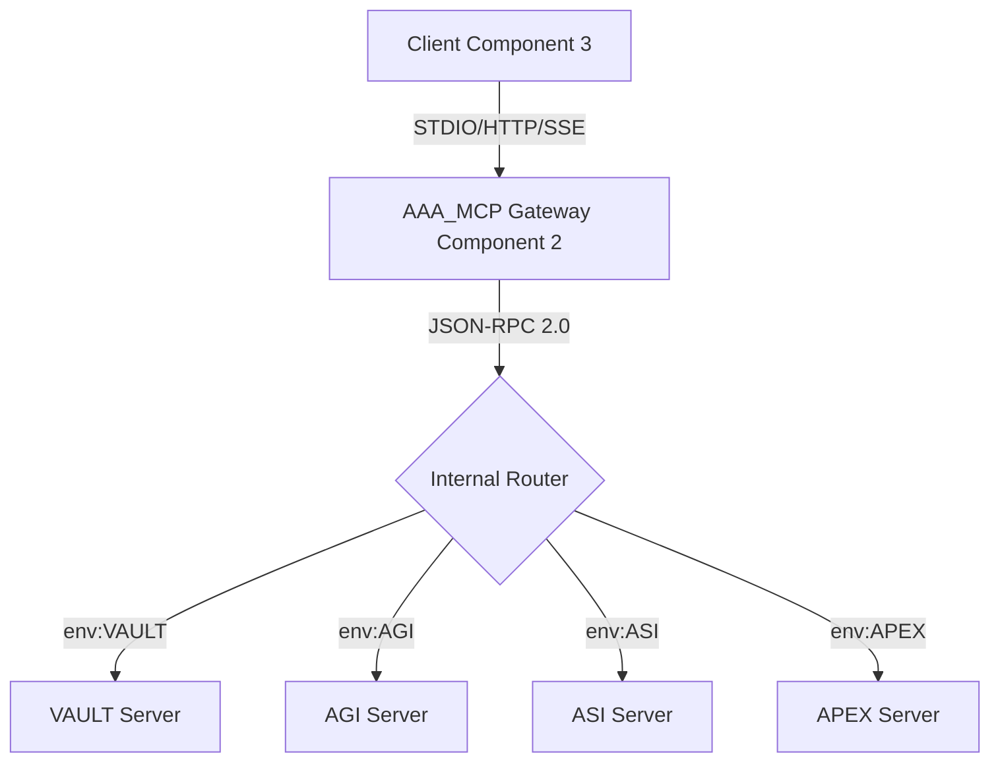

# AAA_MCP Transport Gateway Blueprint (Component 2)

**Version:** v1.0.0
**Epoch:** 2026-01-18
**Authority:** Δ Antigravity (Architect)
**Reference:** [AGENTS.md](AGENTS.md)

---

## 1. Executive Summary

The **AAA_MCP Transport Gateway** is the "Unified Wire" (Component 2) of the arifOS v49 MCP architecture. It acts as an abstraction layer between **Clients (Component 3)** (Claude, ChatGPT, etc.) and **Servers (Component 1)** (Trinity VAULT, AGI, ASI, APEX).

**Core Responsibility:**
- Detect and handle diverse transport protocols (STDIO, HTTP, SSE, gRPC).
- Normalize all incoming messages to standard **JSON-RPC 2.0**.
- Route requests to the appropriate internal server based on `AAA_MCP_LLM_PROVIDER` environment variable or request context.
- Manage stream lifecycles using `anyio` streams.

---

## 2. Architecture Diagram



---

## 3. Implementation Specification

### 3.1 Class Structure

**file:** `arifos_core/orchestrator/mcp_gateway.py`

```python
@dataclass
class TransportClient:
    """Represents a connected client via a specific transport"""
    client_id: str
    transport_type: str  # "stdio", "http", "sse"
    read_stream: MemoryObjectReceiveStream
    write_stream: MemoryObjectSendStream

class MCPGateway:
    """Unified entry point for multiple clients"""
    def __init__(self):
        self.clients: Dict[str, TransportClient] = {}
        self.handlers: Dict[str, Callable] = {}

    async def handle_connection(self, transport_type: str, stream_reader, stream_writer):
        # 1. Create TransportClient abstraction
        # 2. Normalize JSON-RPC 2.0
        # 3. Route to registered handlers
        pass

    def register_handler(self, method: str, handler: Callable):
        self.handlers[method] = handler
```

### 3.2 Key Dependencies
- `anyio`: For stream abstraction and task groups.
- `starlette` / `fastapi`: For HTTP/SSE transport handling.
- `mcp`: Generic MCP SDK types.

### 3.3 Routing Logic
The Gateway checks `os.environ.get("AAA_MCP_LLM_PROVIDER")` or specific request headers to determine the backend target.

**Example Env Config:**
- `AAA_MCP_LLM_PROVIDER=claude` -> Routes to AGI/ASI defaults suitable for Claude.
- `AAA_MCP_LLM_PROVIDER=chatgpt` -> Routes to HTTP transport handler.

---

## 4. Execution Plan (Day 8)

1.  **Scaffold `mcp_gateway.py`:** Create class structure and basic `anyio` stream handling.
2.  **Implement STDIO Transport:** Use `anyio.run_process` or standard input streams for local Claude Desktop support.
3.  **Implement HTTP/SSE Transport:** Simple FastAPI wrapper to expose URL endpoints.
4.  **Wire to Trinity Servers:** Import `vault_server`, `agi_server` etc. and wrap their method handlers.

---

**DITEMPA BUKAN DIBERI.**
